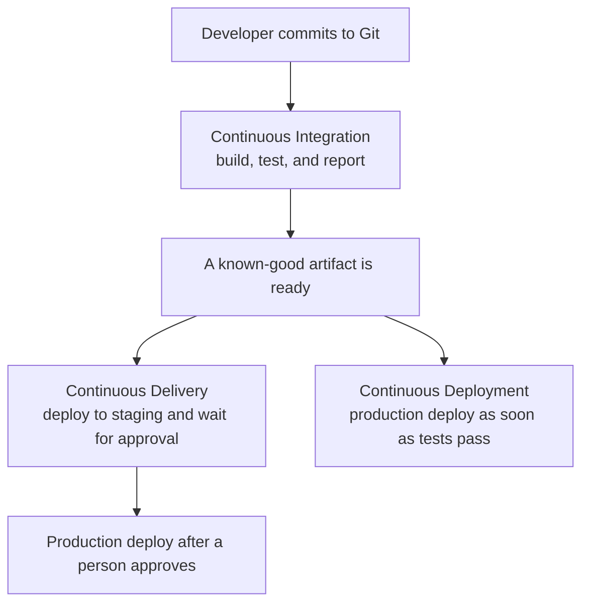
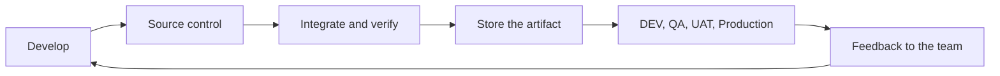
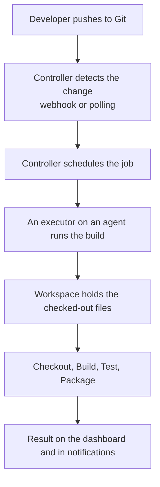
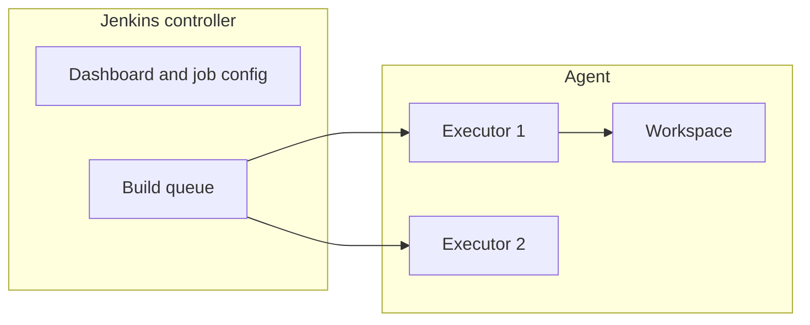

# Lab 00 — Introduction to CI/CD and Jenkins

**Type:** Concept briefing  
**When:** Before Day 1  
**Duration:** 45–60 minutes  
**Difficulty:** Beginner

Read and discuss this lab before opening Jenkins. No installation is required.

Days 1–5 use one company, **QuickCart**, an e-commerce business. This briefing introduces that story and the words you will use for the rest of the course.

---

## Business scenario

QuickCart’s storefront team ships changes to the cart, checkout, and order tracking several times a week.

Today the release path is manual:

```text
Developer writes code
        ↓
Runs the build on a laptop
        ↓
Runs tests if time allows
        ↓
Copies a JAR or WAR to a shared folder
        ↓
Operations deploys it to staging, then production
```

That path causes the problems this course is here to remove:

- Two developers integrate large changes at the end of the week and spend days fixing conflicts.
- A build that works on one laptop fails on another.
- Tests are sometimes skipped, so defects reach customers.
- Nobody can say with confidence which build is running in staging.
- A production release depends on who is available to copy files and click through servers.

QuickCart has chosen **Jenkins** as the automation server. Your job, starting on Day 1, is to learn that server and gradually replace the manual path with a pipeline:

```text
Commit
  ↓
Build
  ↓
Test
  ↓
Package
  ↓
Store the artifact
  ↓
Approve
  ↓
Deploy
```

This lab names each part of that path. Later labs build it.

## What you will be able to explain

- What Continuous Integration, Continuous Delivery, and Continuous Deployment each do
- Where a manual approval sits in Continuous Delivery
- What Jenkins is and how a controller uses agents
- The difference between a job, a build, a node, an executor, a workspace, and an artifact
- How a Freestyle job differs from a Pipeline
- What Pipeline-as-Code means, and how Declarative and Scripted Pipelines differ
- The meaning of `pipeline`, `agent`, `stages`, `stage`, and `steps`

---

## 1. What CI/CD means

**CI/CD** is the set of practices that automate integrating, testing, and releasing code so delivery is faster and more repeatable.

The abbreviation covers three practices. The first is Continuous Integration. The next two are both called CD, and they are not the same. This lab keeps them separate: **Continuous Delivery** and **Continuous Deployment**.



---

## 2. Continuous Integration

**Continuous Integration** is the practice of merging code often into a shared repository such as GitHub or GitLab. Each commit starts an automated build and test run, so a change is checked against the rest of the codebase while it is still small.

**Goal:** find integration failures early.

**Typical flow:**

1. A developer commits code to Git.
2. Jenkins detects the change by webhook or by polling.
3. The code is compiled with the team’s build tool. This course uses **Maven**.
4. Unit tests run automatically.
5. Jenkins publishes the result on the dashboard, and can notify the team.

**What QuickCart gains:**

- Defects show up on the commit that introduced them.
- Every developer builds with the same commands.
- Merge conflicts stay small.
- The author gets feedback without asking someone to try the build.

---

## 3. Continuous Delivery

**Continuous Delivery** starts from a successful integration build. Every change that passes the automated checks is kept in a state where it **can be released** to staging or production with a deliberate action.

**Goal:** make a release predictable and available on demand.

**Typical flow:**

1. The pipeline publishes the build artifact.
2. The same artifact is deployed to a staging environment.
3. Smoke or integration checks run there.
4. A person approves production.
5. Production is updated when the business is ready.

**What QuickCart gains:**

- Staging always has a build that already passed CI.
- Production is a decision, not a fresh manual rebuild.
- The same binary that was tested is the binary that is released.

This course implements Continuous Delivery through Day 4: publish the artifact, retrieve that same artifact, and pass a manual approval before a simulated deployment.

---

## 4. Continuous Deployment

**Continuous Deployment** removes the human approval. After the automated checks pass, the pipeline deploys to production by itself.

**Goal:** make the release path fully automatic.

**Example:** a merge to `main` passes build and test, and the pipeline deploys that version to production.

**What QuickCart would gain:**

- The shortest path from commit to customer
- No waiting for an approver
- A model that suits products which release many times a day and trust their automated checks

QuickCart is not starting there. The course teaches the practice so you can tell it apart from Continuous Delivery. The labs stop at an approval gate.

---

## 5. CI, Continuous Delivery, and Continuous Deployment

| Aspect | Continuous Integration | Continuous Delivery | Continuous Deployment |
|---|---|---|---|
| Goal | Integrate and verify code frequently | Keep every good build releasable | Release every good build to production |
| Trigger | Code commit | A successful CI run | A successful test run |
| Manual approval | Not part of the practice | Used before production | Not used |
| Deployment | Build and test environment | Staging automatically, production on request | Production automatically |
| QuickCart in this course | Days 1–3 | Days 4–5 | Explained here, not built in the labs |

---

## 6. The software delivery lifecycle

Jenkins sits in the middle of the lifecycle. It does not replace Git, the build tool, or the place where the application runs. It connects them.



| Stage | QuickCart example | Where you meet it |
|---|---|---|
| Develop | Change the Order Service | Day 3, the Maven application |
| Source control | Git repository and `Jenkinsfile` | Days 2–3 |
| Integrate and verify | Compile, unit test, test report | Days 1–3 |
| Store the artifact | JFrog Artifactory | Day 4 |
| Release | Approval, then DEV / QA / UAT | Days 4–5 |
| Feedback | Console log, test results, success or failure | Every day |

---

## 7. What Jenkins is

Jenkins is an open-source automation server used for Continuous Integration and Continuous Delivery. It runs the build, test, package, and delivery steps so the team can release more often with the same process every time.

Jenkins is written in Java. A plugin ecosystem of more than 1,800 plugins connects it to source control, build tools, artifact repositories, and deployment targets. In this course the main connections are **Git**, **Maven**, **JUnit**, the **Credentials Store**, and **JFrog Artifactory**.

| Category | Detail |
|---|---|
| Type | Open-source automation server |
| Language | Java |
| Primary use | CI/CD automation |
| Strengths | Plugins, pipelines, distributed builds |
| Other tools you may see | GitHub Actions, GitLab CI, CircleCI, Azure DevOps, TeamCity |

---

## 8. How Jenkins works



1. A developer commits to GitHub, GitLab, or Bitbucket.
2. Jenkins detects the change.
3. The pipeline checks out the code, builds it, tests it, packages an artifact such as a `.jar` or `.war`, and can hand that artifact to a later delivery stage.
4. The team sees the result in Jenkins, and can also receive it by email or chat.

The controller coordinates work. The agent performs it. They may be the same machine in a training setup, which is what `agent any` means when only one node exists.

### Controller and agent

| Piece | Role |
|---|---|
| Controller | Serves the web UI, stores job configuration, schedules builds, and holds credentials and build history |
| Agent (node) | A machine that executes the build |
| Executor | One slot on a node. Two executors can run two builds at the same time |
| Workspace | The directory on that node where the job’s files live for one build |

Older Jenkins material calls the controller the **master**. Current Jenkins uses **controller**. This course uses controller.



---

## 9. Core concepts

| Term | Meaning |
|---|---|
| Job or project | A configured task, such as “build the Order Service” |
| Build | One execution of that job. Build #12 is the twelfth run |
| Node | A machine Jenkins can run work on. The controller is a node. Agents are nodes |
| Executor | A slot on a node that runs one build at a time |
| Workspace | The job’s working directory on the node |
| Pipeline | The staged flow: Checkout, Build, Test, Package, and later Deploy |
| Stage | A named phase shown in the pipeline view |
| Step | A single command inside a stage |
| Artifact | A file produced by the build, such as `quickcart-order-service.jar` |
| Freestyle job | A job configured in the Jenkins UI, build step by build step |
| Pipeline job | A job whose flow is written as code |

### Freestyle and Pipeline

| | Freestyle | Pipeline |
|---|---|---|
| Where the flow lives | Jenkins job configuration | A pipeline script, usually a `Jenkinsfile` in Git |
| How it reads | Forms and build steps | Stages you can see in the stage view |
| Change control | Edited in the UI | Reviewed and versioned with the application |
| Fit for this course | Day 1, to learn jobs, builds, and console output | Day 1 onward, and every later day |

Day 1 uses a Freestyle job so you can see a build and its console log. The same day moves that work into a Pipeline, because a multi-stage delivery flow is easier to read, review, and keep with the source code.

### Pipeline-as-Code

Pipeline-as-Code means the delivery flow is a file in the repository, conventionally named `Jenkinsfile`. Changing the flow is a commit. The history of the pipeline sits next to the history of the application.

Jenkins runs two pipeline syntaxes:

| Syntax | Shape | Use in this course |
|---|---|---|
| Declarative | A fixed structure: `pipeline`, `agent`, `stages`, `steps`, and optional `post` | Every hands-on lab |
| Scripted | A Groovy program starting with `node` | Recognized here so you can read older examples. The labs do not ask you to write it |

Declarative Pipeline is the form you will write:

```groovy
pipeline {
    agent any
    stages {
        stage('Build') {
            steps {
                echo 'Compile the QuickCart Order Service'
            }
        }
        stage('Test') {
            steps {
                echo 'Run QuickCart unit tests'
            }
        }
        stage('Package') {
            steps {
                echo 'Produce the QuickCart artifact'
            }
        }
    }
}
```

| Block | Role |
|---|---|
| `pipeline` | Wraps the whole Declarative Pipeline |
| `agent any` | Runs on any available node |
| `stages` | The ordered list of phases |
| `stage` | One phase, drawn as its own column in the stage view |
| `steps` | The commands inside that phase |

On Day 1 the steps are `echo` commands, so you can learn the structure before a real application exists. On Day 3 those echoes become Maven commands:

```groovy
sh 'mvn clean compile'          // Build
sh 'mvn test'                   // Test
sh 'mvn package -DskipTests'    // Package the JAR that already passed tests
```

A Windows agent uses `bat` in place of `sh`. The stages stay the same.

Day 4 extends the same pipeline with credentials, Artifactory, a manual approval, and a simulated deployment. That is the Continuous Delivery path from section 3. A Kubernetes or Docker command can be a deploy step in other projects. This course keeps deployment simulated so the pipeline, the artifact, and the approval stay visible.

---

## 10. What Jenkins provides

| Feature | What it means for QuickCart |
|---|---|
| Installation | Windows service, a `.war` file, or a Docker image. [Lab 01](Lab%2001%20-%20Installation%20and%20Setup%20Jenkins.md) covers the Windows service and the Docker install |
| Plugins | Git, Maven, JUnit, credentials, and Artifactory, plus many targets this course does not configure |
| Pipeline-as-Code | The `Jenkinsfile` is reviewed with the Order Service |
| Distributed builds | The controller can send work to agents when one machine is not enough |
| Ecosystem | GitHub, SonarQube, JFrog Artifactory, and, in other solutions, Docker or Kubernetes |
| Notifications | The dashboard is required. Email or chat can be added |
| Access control | Users sign in. Production Jenkins is often tied to a company directory |
| Reports | Build history, stage view, and published test results |

### Why teams adopt it

- The same build runs for every commit.
- Integration problems appear before release day.
- A failed stage is visible in the log, which Day 5 practices on purpose.
- Work can be spread across agents.
- The pipeline definition can be restored from Git because it is code.

---

## 11. Other tools you will hear named

Jenkins is the automation server for this course. These tools solve related problems and often sit beside it.

| Category | Examples |
|---|---|
| CI/CD platforms | Jenkins, GitHub Actions, GitLab CI/CD, CircleCI, Travis CI |
| Cloud pipelines | AWS CodePipeline, Azure DevOps, Google Cloud Build |
| Delivery and deployment | Argo CD, Tekton, Spinnaker |

---

## 12. Confirm you can explain

Before Day 1, you should be able to answer these in your own words.

1. What does QuickCart do today that the pipeline is meant to replace?
2. What happens in Continuous Integration when a developer commits?
3. Where does a person approve a release in Continuous Delivery?
4. What does Continuous Deployment do after the tests pass?
5. Which machine schedules a build, and which machine runs it?
6. What is the difference between a job and a build?
7. Why will QuickCart keep the pipeline in a `Jenkinsfile`?
8. Name the five blocks in the sample Declarative Pipeline and what each one does.

---

## What you do next

| Step | Lab |
|---|---|
| Install Jenkins on Windows or with Docker | [Lab 01 — Installation and Setup of Jenkins](Lab%2001%20-%20Installation%20and%20Setup%20Jenkins.md). Complete Lab 1 or Lab 2 |
| Start the Day 1 hands-on work | [Lab 02 — Jenkins and CI/CD Fundamentals](Lab%2002%20-%20Jenkins%20and%20CI-CD%20Fundamentals.md) |

Day 1 opens the dashboard, runs a Freestyle job, reads a failed build, and creates the first Declarative Pipeline for QuickCart.
