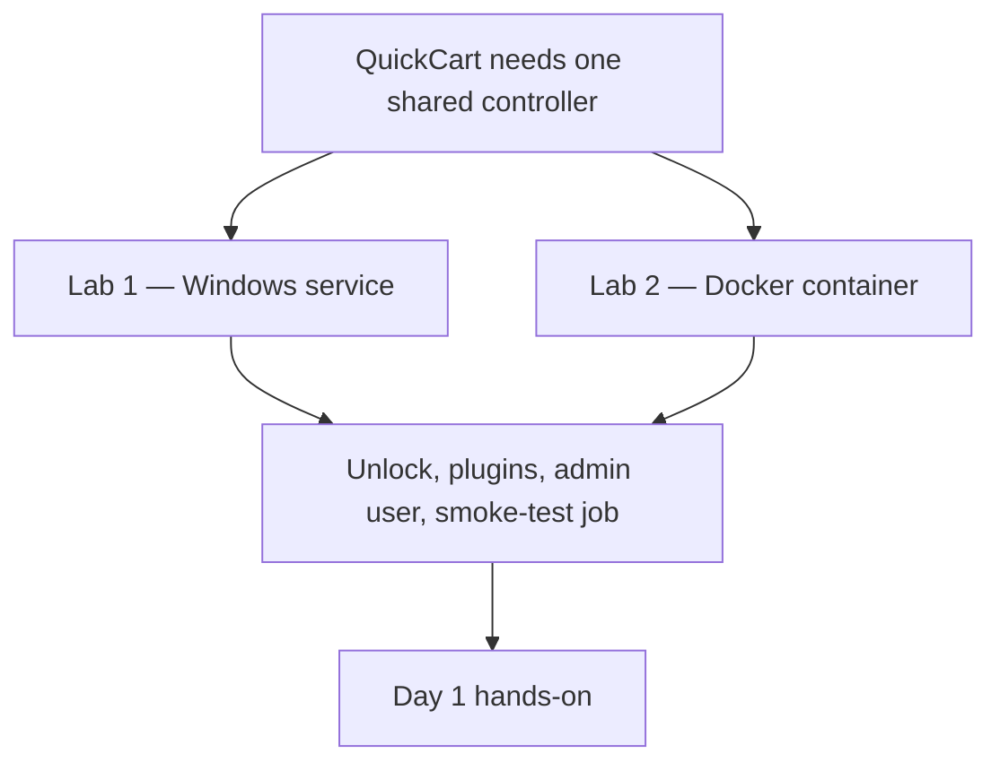
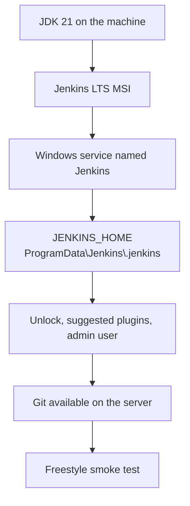
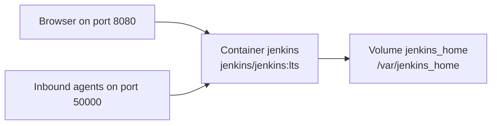

# Lab 01 — Installation and Setup of Jenkins

**Type:** Hands-on setup  
**When:** After [Lab 00](Lab%2000%20-%20Introduction%20to%20CI-CD%20and%20Jenkins.md), before Day 1  
**Duration:** 30–45 minutes for the path you choose  
**Difficulty:** Beginner

Install one Jenkins controller that the rest of the course can use. Complete **Lab 1** or **Lab 2**. Both produce the same result: a Jenkins LTS controller, an admin user, suggested plugins, and a successful smoke-test job.

If an instructor has already provided a Jenkins URL and login, skip this lab and start [Lab 02 — Day 1](Lab%2002%20-%20Jenkins%20and%20CI-CD%20Fundamentals.md).

---

## Business scenario

QuickCart’s builds still run on developer laptops. The platform team needs one shared Jenkins controller so every commit can be built the same way.

Two installations meet that need:

| Lab | How Jenkins runs | Why a team chooses it |
|---|---|---|
| Lab 1 | Windows service | The build server is Windows. The controller starts at boot and is managed like any other service |
| Lab 2 | Docker container | The team wants to replace the controller by recreating the container. Jobs, users, and plugins stay on the `jenkins_home` volume |



Run one lab. If you run the second lab on the same machine, port 8080 is already taken. Use another host port, such as 9090, for the second controller.

---

## What you will have when the lab is complete

- Jenkins LTS is running and reachable in a browser
- The initial setup is unlocked and an admin user exists
- Suggested plugins are installed
- A Freestyle job has finished with **SUCCESS**
- You know where `JENKINS_HOME` is, because that directory is the backup of this controller

---

# Lab 1 — Install Jenkins on Windows

### Estimated time
35–45 minutes

### Difficulty
Beginner

### Objectives

- Install JDK 21, which current Jenkins LTS requires and which later Maven builds will use
- Install Jenkins LTS as a Windows service
- Unlock Jenkins and create the first admin user
- Install the suggested plugins
- Register Git, and confirm Java is available
- Prove the controller with a Freestyle job
- Recover from a busy port, a stopped service, or a failed plugin download

### Prerequisites

- Windows 10/11 Pro or Enterprise, or Windows Server 2019/2022
- Local administrator rights
- Outbound network access for the Jenkins download and plugins
- Port **8080** free, or a plan to use another port

### How this install is put together



The service is the controller. `JENKINS_HOME` holds jobs, users, plugins, and secrets. Back up that folder and the controller configuration can be restored.

---

## Step 1 — Install JDK 21

Jenkins LTS **2.555.1 and later** runs on **Java 21 or Java 25**. The current LTS line, **2.568**, is in that range. Java 17 cannot start this controller.

Day 3 builds the QuickCart Order Service with Maven on the same JDK. Install **JDK 21**, for example Adoptium Temurin 21 or the Microsoft Build of OpenJDK 21.

The Windows MSI also bundles a Java runtime for the service. Install a system JDK as well, so `java` and Maven use Java 21 in a terminal.

1. Install JDK 21 and let the installer add it to `PATH` if that option is offered.
2. Open a new PowerShell window and verify:

   ```powershell
   java -version
   ```

   The reported version should be 21.

3. If a later tool needs `JAVA_HOME`, set only that variable. Point it at the JDK folder, not at the `bin` folder:

   ```powershell
   setx JAVA_HOME "C:\Program Files\Eclipse Adoptium\jdk-21"
   ```

   Replace the path with the folder that was actually created, such as `jdk-21.0.x-hotspot`. Close and reopen PowerShell before you rely on it.

Leave the system `PATH` to the JDK installer. Rewriting `PATH` with `setx` can truncate a long path and break other tools.

---

## Step 2 — Install the Jenkins Windows service

1. Download the **Jenkins LTS** Windows MSI from the official Jenkins site.
2. Run the installer:

   - **Destination folder:** keep the default, `C:\Program Files\Jenkins`.
   - **Service account:**
     - Training and demos: **Local System**.
     - A shared build server: a dedicated `jenkins` account with **Log on as a service**. Lab 1 returns to that account in Step 8.
   - **Port:** **8080**, unless you already know that port is taken.
3. Finish the wizard. The installer creates the **Jenkins** service, sets `JENKINS_HOME`, and starts the service.

   The default home directory is:

   ```text
   C:\ProgramData\Jenkins\.jenkins
   ```

   That path is also `%ProgramData%\Jenkins\.jenkins`.
4. Confirm the service:

   ```powershell
   Get-Service Jenkins
   ```

   Status should be **Running**.
5. If Windows Defender Firewall asks for access, allow Java or Jenkins on private networks. Step 7 has the matching firewall rule.

---

## Step 3 — Unlock Jenkins and create the admin user

1. Open [http://localhost:8080/](http://localhost:8080/).
2. Jenkins shows **Unlock Jenkins**. Read the initial admin password from `JENKINS_HOME`:

   ```powershell
   Get-Content "$env:ProgramData\Jenkins\.jenkins\secrets\initialAdminPassword"
   ```

   If that file is not there, try the copy some installers leave next to the program:

   ```powershell
   Get-Content "C:\Program Files\Jenkins\secrets\initialAdminPassword"
   ```

3. Paste the password and continue.
4. Choose **Install suggested plugins**.
5. Create the admin user: username, password, full name, and email.
6. Confirm the Jenkins URL. Keep `http://localhost:8080/` when you are on the same machine.
7. Select **Start using Jenkins** when plugin installation finishes.

The password file is only the setup key. Sign in with the admin user after this step.

---

## Step 4 — Make Git available

Day 2 stores the pipeline in Git. Day 3 checks that repository out from Jenkins.

1. If `git` is missing, install it from [https://git-scm.com/download/win](https://git-scm.com/download/win).
2. Verify in a new PowerShell window:

   ```powershell
   git --version
   ```

3. In Jenkins, open **Manage Jenkins → Tools** (Global Tool Configuration).
4. Under **Git**, add an installation named `Default`.
   - Leave the path empty to let Jenkins find `git` on `PATH`, or
   - Set the path explicitly, for example `C:\Program Files\Git\bin\git.exe`.

Maven is required on Day 3. Install Maven 3.9 or later now, or at the start of Day 3, and add it on this same Tools page. Node.js is not used in this course.

---

## Step 5 — Run a smoke-test job

1. Select **New Item**.
2. Name the job `quickcart-hello-windows`.
3. Choose **Freestyle project** and select **OK**.
4. Under **Build**, add **Execute Windows batch command**:

   ```bat
   echo Hello from Jenkins on Windows
   ```

5. Save, then select **Build Now**.
6. Open the build and then **Console Output**.

   Confirm the echo text and **Finished: SUCCESS**.

This job only proves the controller can run a build. Day 1 replaces it with the QuickCart jobs.

---

## Step 6 — Open the firewall or change the port

Use this step when another machine must reach Jenkins, or when port 8080 is already in use.

### Allow inbound TCP 8080

Run PowerShell as Administrator:

```powershell
New-NetFirewallRule -DisplayName "Jenkins 8080" -Direction Inbound -Protocol TCP -LocalPort 8080 -Action Allow
```

### Move Jenkins to port 9090

1. Stop the service:

   ```powershell
   Stop-Service Jenkins
   ```

2. Edit `C:\Program Files\Jenkins\jenkins.xml`.
3. Change `--httpPort=8080` to `--httpPort=9090`.
4. Start the service:

   ```powershell
   Start-Service Jenkins
   ```

5. Open [http://localhost:9090/](http://localhost:9090/).
6. In Jenkins, set **Jenkins URL** under **Manage Jenkins → System** to the URL you actually use.

---

## Step 7 — Use a dedicated service account

Local System is enough for this training. On a shared QuickCart build server, run the service as its own account.

1. Open `services.msc`, open **Jenkins**, and on the **Log On** tab select the dedicated account.
2. Grant that account **Modify** on `%ProgramData%\Jenkins\.jenkins`, on the directories where jobs will check out code, and on the Git and JDK folders if the service must read them.
3. Restart the service:

   ```powershell
   Restart-Service Jenkins
   ```

---

## Step 8 — Back up and upgrade

- **Backup:** copy `%ProgramData%\Jenkins\.jenkins`. It contains jobs, users, plugins, and secrets.
- **Upgrade:** download the newer LTS MSI and run it in place. Take the backup first.
- After an upgrade, open **Manage Jenkins → Plugins** and confirm the plugins still match the controller version.

---

## Lab 1 troubleshooting

### The page does not load

```powershell
Get-Service Jenkins
Start-Service Jenkins
```

See whether 8080 is already taken:

```powershell
netstat -aon | findstr :8080
```

If another process owns the port, move Jenkins using Step 6.

### Plugins fail to download

A corporate proxy is configured under **Manage Jenkins → Plugins → Advanced settings**. On older Jenkins releases the same page is **Manage Jenkins → Manage Plugins → Advanced**.

The machine also needs outbound HTTPS to the Jenkins update site.

### Access is denied to the workspace or a tool

The service account needs **Modify** on `JENKINS_HOME`, checkout directories, and the Git and JDK directories.

### The service stops

Read:

- `%ProgramData%\Jenkins\.jenkins\logs\jenkins.log`
- Windows Event Viewer → **Windows Logs → Application**

Confirm the service is using Java 21 or Java 25. Current Jenkins LTS does not start on Java 17. The error is in `jenkins.log` and mentions the Java version.

---

## Optional — Run `jenkins.war` instead of the service

Use this when you want a foreground controller and do not want a Windows service.

1. Download the Jenkins LTS `jenkins.war`.
2. Run it with JDK 21:

   ```powershell
   cd C:\tools\jenkins
   java -jar jenkins.war --httpPort=8080
   ```

3. Open [http://localhost:8080/](http://localhost:8080/) and continue at Step 3.

   The initial password is printed in the console and written under the `.jenkins` folder in the user profile that started the process.

The process stops when that PowerShell window closes. The MSI service is the setup this course expects on Windows.

---

## Lab 1 verification

- [ ] `Get-Service Jenkins` shows **Running**, or `jenkins.war` is running in the foreground
- [ ] [http://localhost:8080/](http://localhost:8080/) opens, or your chosen port opens
- [ ] Suggested plugins are installed
- [ ] You can sign in as the admin user you created
- [ ] `git --version` succeeds
- [ ] `quickcart-hello-windows` ends **Finished: SUCCESS**

Continue at [What you do next](#what-you-do-next).

---

# Lab 2 — Install Jenkins with Docker

### Estimated time
25–35 minutes

### Difficulty
Beginner

### Objectives

- Run Jenkins LTS in Docker
- Keep `JENKINS_HOME` on a volume so a new container keeps the same jobs and users
- Unlock Jenkins and create the admin user
- Install the suggested plugins
- Prove the controller with a Freestyle job
- Back up, upgrade, and recover without losing that volume

### Prerequisites

- Docker Desktop on Windows or macOS, or Docker Engine on Linux
- Permission to run Docker
- Port **8080** free on the host, or another host port you will map

Verify Docker before you start:

```powershell
docker version
docker info
```

`docker info` should return engine details. If it errors, start Docker Desktop and wait until it is running.

### How this install is put together



Port 8080 is the web UI. Port 50000 is reserved for inbound agents, which Day 1 introduces. The volume is the controller’s memory: delete the container and keep the volume, and the jobs are still there.

---

## Step 1 — Create the volume and start Jenkins

Create the volume first:

```powershell
docker volume create jenkins_home
```

Start the controller. This single line works in PowerShell, Command Prompt, and a Linux or macOS shell:

```powershell
docker run -d --name jenkins -p 8080:8080 -p 50000:50000 -v jenkins_home:/var/jenkins_home jenkins/jenkins:lts
```

| Published port | Purpose |
|---|---|
| `8080:8080` | Jenkins web UI |
| `50000:50000` | Inbound agents |
| `jenkins_home:/var/jenkins_home` | Jobs, users, plugins, and secrets |

If port 8080 is busy, publish another host port:

```powershell
docker run -d --name jenkins -p 9090:8080 -p 50000:50000 -v jenkins_home:/var/jenkins_home jenkins/jenkins:lts
```

Then open [http://localhost:9090/](http://localhost:9090/) instead of port 8080.

Wait about a minute for the first start, then confirm the container is up:

```powershell
docker ps --filter name=jenkins
```

---

## Step 2 — Unlock Jenkins and create the admin user

Read the initial admin password from inside the container:

```powershell
docker exec jenkins cat /var/jenkins_home/secrets/initialAdminPassword
```

The same password is written to the container log during the first start. In PowerShell:

```powershell
docker logs jenkins 2>&1 | Select-String -Pattern "password"
```

1. Open [http://localhost:8080/](http://localhost:8080/), or the host port you mapped.
2. Paste the password on **Unlock Jenkins**.
3. Choose **Install suggested plugins**.
4. Create the admin user.
5. Confirm the Jenkins URL. Use the host URL you opened, including the port.
6. Select **Start using Jenkins**.

---

## Step 3 — Run a smoke-test job

The official Jenkins image is Linux, so the build step is a shell command even when Docker Desktop is running on Windows.

1. Select **New Item**.
2. Name the job `quickcart-hello-docker`.
3. Choose **Freestyle project** and select **OK**.
4. Under **Build**, add **Execute shell**:

   ```bash
   echo "Hello from Jenkins in Docker"
   ```

5. Save, then select **Build Now**.
6. Open **Console Output** and confirm the message and **Finished: SUCCESS**.

**Execute Windows batch command** is for the Windows service in Lab 1. Inside this container that step fails because there is no `cmd.exe`.

---

## Step 4 — Use Docker Compose when you want the same setup again

Compose records the ports and the volume in a file you can start with one command.

```powershell
mkdir jenkins-docker
cd jenkins-docker
```

Save this as `docker-compose.yml` in that folder:

```yaml
services:
  jenkins:
    image: jenkins/jenkins:lts
    container_name: jenkins
    restart: unless-stopped
    ports:
      - "8080:8080"
      - "50000:50000"
    volumes:
      - jenkins_home:/var/jenkins_home
volumes:
  jenkins_home:
```

If you already created the container in Step 1, stop and remove it before Compose starts a container of the same name:

```powershell
docker stop jenkins
docker rm jenkins
```

The volume `jenkins_home` stays. Compose will attach the new container to it.

```powershell
docker compose up -d
docker compose ps
docker compose logs -f
```

Stop the stack with `docker compose down`. That command removes the container and keeps the named volume.

Unlock and configure Jenkins as in Steps 2 and 3 if this is a new volume. An existing volume already has the admin user.

---

## Step 5 — Keep the home directory, manage the container, and upgrade

### Everyday commands

```powershell
docker ps
docker logs -f jenkins
docker restart jenkins
docker exec -it jenkins bash
```

### See the home directory on the host

A named volume is the default in this lab. Use a bind mount when you want the files visible in a normal folder.

PowerShell:

```powershell
New-Item -ItemType Directory -Force -Path C:\jenkins_home
docker run -d --name jenkins -p 8080:8080 -p 50000:50000 -v "C:\jenkins_home:/var/jenkins_home" jenkins/jenkins:lts
```

Linux or macOS:

```bash
mkdir -p "$HOME/jenkins_home"
docker run -d --name jenkins -p 8080:8080 -p 50000:50000 -v "$HOME/jenkins_home:/var/jenkins_home" jenkins/jenkins:lts
```

On a Linux bind mount, Jenkins runs as uid 1000. If the container cannot write the folder:

```bash
sudo chown -R 1000:1000 "$HOME/jenkins_home"
```

### Back up the named volume

Linux or macOS:

```bash
docker run --rm -v jenkins_home:/data -v "$PWD":/backup alpine sh -c "cd /data && tar czf /backup/jenkins_home_backup.tgz ."
```

PowerShell, from the folder where you want the backup file:

```powershell
docker run --rm -v jenkins_home:/data -v "${PWD}:/backup" alpine sh -c "cd /data && tar czf /backup/jenkins_home_backup.tgz ."
```

### Upgrade the controller

1. Back up the volume.
2. Pull the image and recreate the container. Keep the same volume name.

   ```powershell
   docker pull jenkins/jenkins:lts
   docker stop jenkins
   docker rm jenkins
   docker run -d --name jenkins -p 8080:8080 -p 50000:50000 -v jenkins_home:/var/jenkins_home jenkins/jenkins:lts
   ```

   With Compose, from the folder that contains `docker-compose.yml`:

   ```powershell
   docker compose pull
   docker compose up -d
   ```

3. Open **Manage Jenkins → Plugins** and update plugins that the new controller requires.

`docker rm` removes the container. It does not remove the `jenkins_home` volume.

---

## Optional — Let a pipeline run Docker

Days 1–5 do not need this. The five-day labs compile with Maven and simulate deployment. Use this section only with [Lab 07](Lab%2007%20-%20Capstone%201%20Deploy%20Web%20App%20on%20Docker.md), where Jenkins builds an image.

### Linux or macOS — mount the Docker socket

Add the host socket to the Compose service:

```yaml
services:
  jenkins:
    image: jenkins/jenkins:lts
    ports:
      - "8080:8080"
    volumes:
      - jenkins_home:/var/jenkins_home
      - /var/run/docker.sock:/var/run/docker.sock
volumes:
  jenkins_home:
```

The container still needs a Docker client. On Linux, install the client inside the image you run, or use an agent that already has Docker. Mounting the socket gives that client control of the host engine, so keep this on a training machine.

### Windows Docker Desktop

The engine socket is a named pipe. Mounting it into the official Linux Jenkins image is unreliable. For Lab 07 on Windows, run Jenkins in WSL2 and mount `/var/run/docker.sock` there, or run the Jenkins service as the Windows user who can already run `docker`.

### Preferred pattern for this course

Leave the controller as installed in Step 1. When a job must run `docker build`, send that job to an agent where Docker is already installed. The controller stays small, and Days 1–5 stay on the controller you just created.

---

## Lab 2 troubleshooting

### Port 8080 is already in use

Publish a different host port, for example `-p 9090:8080`, and open `http://localhost:9090`. Set **Jenkins URL** to that address.

### The container exits or keeps restarting

```powershell
docker logs -f jenkins
```

Confirm the disk is not full and the volume or bind mount is writable. On Linux, fix ownership with `chown 1000:1000` as shown in Step 5.

### Plugins fail to download

Open **Manage Jenkins → Plugins → Advanced settings** and set the corporate HTTP or HTTPS proxy.

Or recreate the container with `HTTP_PROXY`, `HTTPS_PROXY`, and `NO_PROXY` set to the values your network requires.

### The smoke-test job cannot find `sh`

You are in the Linux container from this lab. Use **Execute shell**. **Execute Windows batch command** belongs to Lab 1.

---

## Lab 2 verification

- [ ] `docker ps` shows the **jenkins** container **Up**
- [ ] The web UI opens, the setup is unlocked, and the admin user can sign in
- [ ] Suggested plugins are installed
- [ ] `quickcart-hello-docker` ends **Finished: SUCCESS**
- [ ] You can point to the volume or folder that holds `JENKINS_HOME`

---

# What you do next

Either lab is enough for the hands-on days.

| Next | Where |
|---|---|
| Explore the dashboard, run a job, and create the first pipeline | [Lab 02 — Day 1](Lab%2002%20-%20Jenkins%20and%20CI-CD%20Fundamentals.md) |
| Build a containerized site with Jenkins | [Lab 07 — Capstone 1](Lab%2007%20-%20Capstone%201%20Deploy%20Web%20App%20on%20Docker.md). The agent must be able to run `docker` |

Day 1 assumes Jenkins is already running. You will not install it again.
