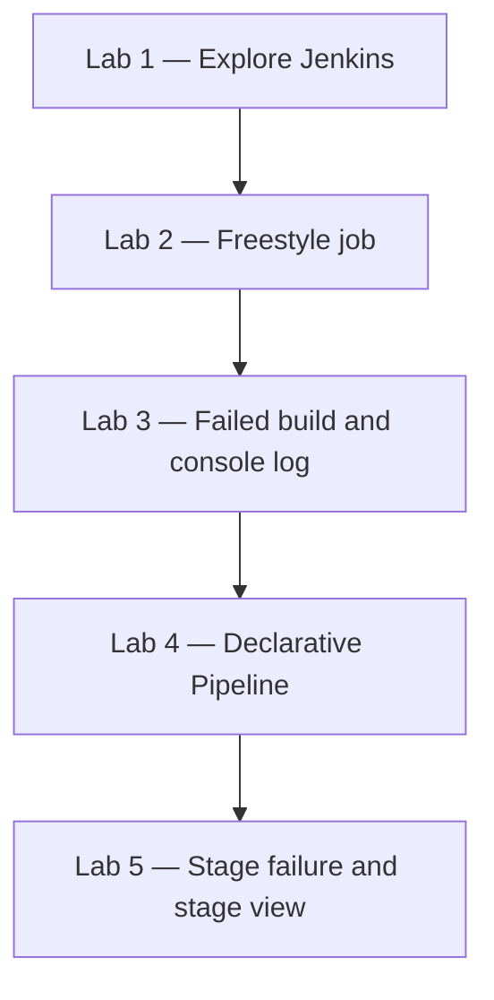
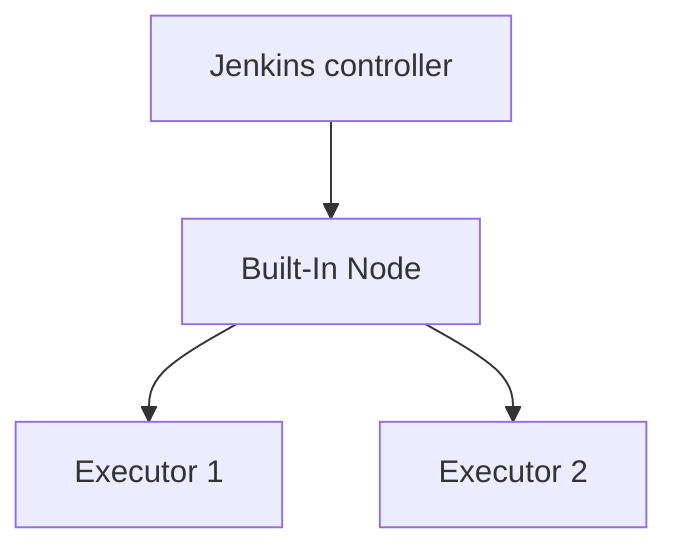
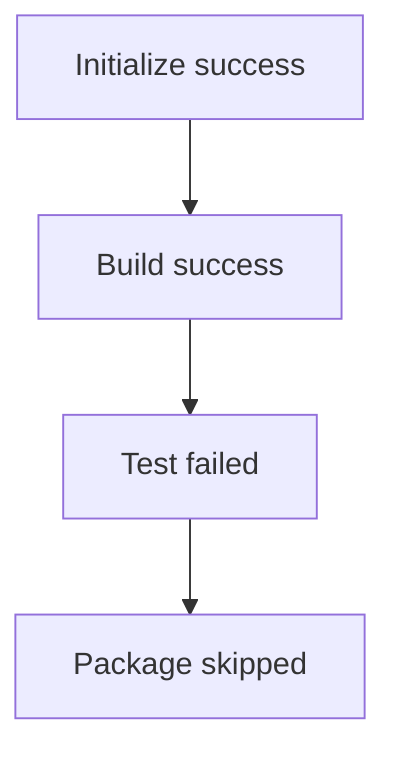

# Lab 02 — Jenkins and CI/CD Fundamentals

**Day 1**  
**Duration:** 4 hours  
**Hands-on:** about 2–2.5 hours  
**Labs:** 5  
**Level:** Beginner

This is the Day 1 hands-on manual. [Lab 00](Lab%2000%20-%20Introduction%20to%20CI-CD%20and%20Jenkins.md) introduced the words. [Lab 01](Lab%2001%20-%20Installation%20and%20Setup%20Jenkins.md) started the controller, or an instructor has already given you a Jenkins URL. Today you use that controller.

## Business scenario

QuickCart has a Jenkins controller. The DevOps team has not automated the Order Service yet. Before anyone connects Git or Maven, the team needs to prove four things:

- People can find their way around Jenkins
- Jenkins can run a job and record the result
- A failed build can be diagnosed from Build History and Console Output
- A delivery flow can be written as a Declarative Pipeline and shown as stages

You are a new member of that team. The five labs are one sequence.



| Lab | Job you will have | What it proves |
|---|---|---|
| 1 | None yet | You can find the dashboard, nodes, executors, and Build History |
| 2 | `quickcart-environment-check` | A Freestyle job can run and succeed |
| 3 | Same job | A failed build can be traced and repaired |
| 4 | `quickcart-basic-pipeline` | Build, Test, and Package can be stages in one Pipeline |
| 5 | Same pipeline | A failed Test stage stops Package |

## Prerequisites

| Requirement | What you need |
|---|---|
| Jenkins | The controller from Lab 01, or the URL and login from your instructor. Current LTS is 2.568, which needs Java 21 or 25 on a Windows install |
| Browser | Chrome, Edge, or Firefox |
| Access | A user that can create jobs. Lab 01 created an admin user |
| Executors | The built-in node must have at least 1 executor. Lab 1 checks this |
| Editor | Not required today. Pipeline text is entered in Jenkins |

Day 1 does not use Maven, Artifactory, SonarQube, or a Git repository. Those start on later days.

### Which steps to follow

Labs 1, 4, and 5 use the same clicks for both installs. Labs 2 and 3 print **both** command versions. Follow the version that matches how Jenkins was installed, not the operating system of the laptop.

| Your setup | Where it is in Lab 01 | Freestyle build step in Labs 2 and 3 |
|---|---|---|
| Windows service | Lab 1 | **Windows service setup** — Execute Windows batch command |
| Docker container, including Docker Desktop on Windows | Lab 2 | **Docker setup** — Execute shell |
| Instructor server | — | Open **Built-In Node** in Lab 1. Windows architecture uses the Windows version. Linux architecture uses the Docker version |

---

# Lab 1 — Explore Jenkins and Understand the Execution Environment

## Business scenario

QuickCart is introducing Jenkins. You have been given access. Before you create automation, you need to know where jobs are created, where Jenkins is configured, where builds appear, where nodes are managed, and how executors limit how many builds can run at once.

No pipeline code is required.

## Objectives

- Open the Jenkins dashboard
- Find **New Item**, **Build History**, and **Manage Jenkins**
- Open the built-in node and identify its executors
- Explain how a node differs from an executor

### Estimated time
20–25 minutes

### Difficulty
Beginner

---

## Step 1 — Open Jenkins

Open the Jenkins URL.

If you installed Jenkins in Lab 01, that is [http://localhost:8080/](http://localhost:8080/), or the other port you chose.

An instructor URL looks like:

```text
http://<jenkins-host>:8080
```

Use the host and port you were given.

## Step 2 — Sign in

Sign in with your admin user, or with the account the instructor provided.

You should land on the Jenkins dashboard.

## Step 3 — Explore the dashboard

Find these items. Do not change configuration.

- **New Item**
- **Build History**
- **Manage Jenkins**
- Any existing jobs, such as the smoke-test job from Lab 01
- The user menu

**Checkpoint.** A new job is created from **New Item**.

## Step 4 — Open Manage Jenkins

Select **Manage Jenkins** in the left menu.

Current Jenkins shows cards for:

- System
- Tools
- Plugins
- Nodes
- Credentials
- Security
- System Information

On a controller older than the 2.541 LTS line, **Nodes** may be labeled **Manage Nodes and Clouds**. It is the same page.

Leave these settings as they are, except the executor count in the next step when that count is 0.

## Step 5 — Explore nodes and confirm an executor

Open **Manage Jenkins → Nodes**.

Open **Built-In Node**. Older Jenkins releases called this node the master. It is the controller’s own execution environment. This course has no separate agent, so today’s jobs run here.

Record what the page shows:

```text
Node name          Built-In Node
Status             Idle / Online
Executors          a number, often 2
Architecture       Windows … or Linux (amd64)
Free disk space
Response time
```

Write down the architecture. You will use it to pick a version in Labs 2 and 3.

| Architecture on Built-In Node | Version to follow |
|---|---|
| Windows | **Windows service setup** |
| Linux, including `Linux (amd64)` from the Jenkins Docker image | **Docker setup** |

Docker Desktop on a Windows laptop still shows Linux here. The container is the agent. Follow the Docker version.

Then check the executor count.

| Executors shown | What you do |
|---|---|
| 1 or more | Leave the number. Builds can start |
| 0 | This node cannot run a build. Set it to 2 using the steps below |

A count of 0 is normal on a hardened production controller. On this training controller it leaves every later build waiting in the queue.

To set it:

1. On **Built-In Node**, select **Configure**.
2. Set **Number of executors** to `2`.
3. Select **Save**.

Jenkins may show an administrative notice that building on the built-in node is not recommended for production. Keep the count at 2 for this course. There is no other node to run the labs.

The executor count is no longer on **Manage Jenkins → System**. Current Jenkins keeps it on the built-in node only.

## Step 6 — Understand node and executor



A **node** is a machine that can run builds. An **executor** is one slot on that node. With the training setting of two executors, this node can run two builds at the same time when the machine has capacity.

In this course the controller and the agent are often the same machine. `agent any` in a later lab means “use any node that has a free executor.”

## Step 7 — Locate Build History

Return to the dashboard and find **Build History**.

It may be empty, or it may show the smoke-test job from Lab 01. Labs 2 and 3 fill this list.

## Lab 1 verification

| Item | Found |
|---|---|
| Jenkins dashboard | ☐ |
| New Item | ☐ |
| Manage Jenkins | ☐ |
| Nodes, including the built-in node | ☐ |
| Executors on that node, at least 1 | ☐ |
| Build History | ☐ |

You can move through the controller without changing it. Lab 2 creates the first QuickCart job.

---

# Lab 2 — Create and Execute Your First Freestyle Job

## Business scenario

QuickCart wants proof that this Jenkins environment can run a command before anyone trusts it with source code.

The team creates one Freestyle job, `quickcart-environment-check`. The job starts, prints who ran it and where, and finishes successfully.

## Objectives

- Create a Freestyle project
- Add a build step for the agent operating system
- Run the job and read Console Output
- Tell a job apart from a build

### Estimated time
25–30 minutes

### Difficulty
Beginner

### Dependency
Lab 1. You need a Jenkins login that can create jobs.

---

## Step 1 — Create a new item

On the dashboard, select **New Item**.

## Step 2 — Name the job

Enter:

```text
quickcart-environment-check
```

## Step 3 — Select the job type

Select **Freestyle project**, then **OK**.

Jenkins opens the job configuration page. A Freestyle job stores its steps in this form. Lab 4 writes the flow as a pipeline script instead.

## Step 4 — Add a description

On current Jenkins the description is edited from the job page, not only inside the long configuration form.

If the configuration page already shows a **Description** box, paste this text there:

```text
QuickCart environment validation job used to verify that
the Jenkins execution environment is working correctly.
```

If you do not see that box, select **Save** first. On the job page, select **Add description**, paste the same text, and save the dialog. When a description already exists, the control is **Edit description**.

## Step 5 — Configure the build step

Stay on **Configure**, or open it from the job page.

Find the **Build** section. Select **Add build step**. The menu is not named “Build Steps.”

Add **one** build step. Use the Docker version or the Windows service version, matching the architecture you wrote down in Lab 1.

### Docker setup

Use this version when Jenkins is the container from Lab 01, Lab 2. That includes Docker Desktop on a Windows PC.

Select **Execute shell** and enter:


```bash
echo "================================="
echo "QuickCart Environment Check"
echo "================================="

echo "Build started"

echo "Current user:"
whoami

echo "Current directory:"
pwd

echo "Current date:"
date

echo "Environment validation completed successfully"
```

Do not also add a Windows batch step.

### Windows service setup

Use this version when Jenkins is the Windows service from Lab 01, Lab 1.

Select **Execute Windows batch command** and enter:

```bat
echo =================================
echo QuickCart Environment Check
echo =================================

echo Build started

echo Current user:
whoami

echo Current directory:
cd

echo Current date and time:
echo %DATE% %TIME%

echo Environment validation completed successfully
```

Do not also add a shell step. `cd` with no path prints the current directory in Windows batch. `pwd` does that in the Docker shell version.

## Step 6 — Save

Select **Save**. Jenkins opens the job page.

## Step 7 — Run the job

Select **Build Now**. The same action is the play icon in the left menu.

Build History shows a new run, normally **#1**, after the build leaves the queue. A line that stays on **waiting for next available executor** means the built-in node still has 0 executors. Return to Lab 1 Step 5 and set the count to 2, then run the job again.

## Step 8 — Open the build

Select **#1**, then **Console Output**. If the link is labeled **Console**, it is the same page.

## Step 9 — Read the console log

The log should contain the QuickCart banner, the user, the workspace directory, and:

```text
Environment validation completed successfully

Finished: SUCCESS
```

The banner and `Finished: SUCCESS` are the same for both setups. The user and workspace path are not.

**Docker setup.** The user is `jenkins`. The directory is under the container home:

```text
Current user:
jenkins

Current directory:
/var/jenkins_home/workspace/quickcart-environment-check
```

**Windows service setup.** The user is often `nt authority\system` or the Jenkins service account. The directory is under `JENKINS_HOME`:

```text
Current user:
nt authority\system

Current directory:
C:\ProgramData\Jenkins\.jenkins\workspace\quickcart-environment-check
```

A different username is still a success when the banner is present and the build finishes SUCCESS.

## Step 10 — Tell the job from the build

```text
JOB  quickcart-environment-check
        │
        ↓
     BUILD #1
        │
        ↓
      SUCCESS
```

The job is the definition. Build #1 is one execution of that definition. The next run is Build #2, even when the definition does not change.

## Step 11 — Run the job again

Select **Build Now** twice more.

Build History should show:

```text
#3 SUCCESS
#2 SUCCESS
#1 SUCCESS
```

## Lab 2 verification

| Requirement | Expected |
|---|---|
| Job created | `quickcart-environment-check` |
| Job type | Freestyle |
| Build #1 | SUCCESS |
| Later builds | #2 and #3 SUCCESS |
| Console Output | Shows the banner, user, and directory |
| Workspace path | Visible in the log |

The controller can run a QuickCart job and keep every result. Lab 3 breaks that job on purpose.

### If the build fails immediately

| Console text | Cause | Correction |
|---|---|---|
| `Cannot run program "sh"` | The Docker shell step was used on the Windows service | Switch to the **Windows service setup** script |
| `'pwd' is not recognized` or `'date' is not recognized` | The Docker script was pasted into a Windows batch step | Replace it with the **Windows service setup** script |
| `'cd' is not recognized` inside a shell step, or the log shows `cmd` | The Windows batch script was used in the Docker container | Switch to the **Docker setup** script |
| The build never starts | Built-in node has 0 executors | Lab 1 Step 5 |

---

# Lab 3 — Investigate Build History and Troubleshoot a Failed Build

## Business scenario

A QuickCart developer reports that yesterday’s Jenkins build worked and the latest build failed.

You have to answer three questions from Jenkins itself:

- What failed?
- Why did it fail?
- What change makes the next build succeed?

## Objectives

- Force a Freestyle build to fail with a non-zero exit code
- Find the failure in Console Output
- Compare the failed build with the earlier successful builds
- Remove the failure and confirm the next build succeeds

### Estimated time
25–30 minutes

### Difficulty
Beginner

### Dependency
Lab 2. If you start here on your own, create a Freestyle job with one successful build first.

---

## Step 1 — Open the existing job

Open `quickcart-environment-check`.

Build History should still show the successful runs from Lab 2:

```text
#3 SUCCESS
#2 SUCCESS
#1 SUCCESS
```

Your numbers can differ if you ran the job more than three times. Note the latest successful number before you continue.

## Step 2 — Modify the job

Select **Configure** and find the existing build step.

## Step 3 — Introduce a controlled failure

Add these lines at the bottom of the **same** build step you created in Lab 2. Do not add a second build step.

### Docker setup

Append this to the **Execute shell** step:

```bash
echo "Performing application validation"

echo "Validation failed"

exit 1
```

### Windows service setup

Append this to the **Execute Windows batch command** step:

```bat
echo Performing application validation

echo Validation failed

exit /b 1
```

## Step 4 — Save

Select **Save**.

## Step 5 — Run the job

Select **Build Now**.

The new build should be marked **FAILURE**. The earlier builds stay SUCCESS. Jenkins does not rewrite history.

## Step 6 — Open the failed build

Select the failed build number, then **Console Output**.

## Step 7 — Find the failure

Near the end of the log:

```text
Performing application validation

Validation failed

Finished: FAILURE
```

The echo lines are messages. The result changes because of the exit command that follows them.

## Step 8 — Understand exit codes

Jenkins treats a build step as success when the step returns exit code 0. Any other code fails the build.

| Setup | Success | Failure used in this lab |
|---|---|---|
| Docker setup | `exit 0` | `exit 1` |
| Windows service setup | `exit /b 0` | `exit /b 1` |

## Step 9 — Compare Build History

Return to the job. History should now look like this if Lab 2 ended at build #3:

```text
#4 FAILURE
#3 SUCCESS
#2 SUCCESS
#1 SUCCESS
```

Each row is one execution. The failure is traceable to a build number.

## Step 10 — Fix the problem

Select **Configure**.

Remove the failing command from the same step:

- Docker setup: delete `exit 1`
- Windows service setup: delete `exit /b 1`

Change the message from `Validation failed` to:

```text
Validation completed successfully
```

## Step 11 — Save and rerun

Select **Save**, then **Build Now**.

The new build should finish **SUCCESS**.

## Expected Build History

```text
#5 SUCCESS
#4 FAILURE
#3 SUCCESS
#2 SUCCESS
#1 SUCCESS
```

## Troubleshooting record

Fill this in from the failed build before you use it as a habit on later days.

```text
Failed build number:
________________________

Failure found in:
________________________

Root cause:
________________________

Corrective action:
________________________

New build status:
________________________
```

Confirm your notes against this diagnosis:

```text
Failure found in:    Console Output
Root cause:          The build step returned exit code 1 on purpose
Corrective action:   Removed that command and updated the message
New build status:    SUCCESS
```

## Lab 3 verification

You completed this cycle:

```text
Execute → Failure → Build History → Console Output → Cause → Fix → Rerun → SUCCESS
```

Day 5 uses the same cycle on a real pipeline. The place you look does not change: the failed build’s console log.

---

# Lab 4 — Create Your First Declarative Pipeline

## Business scenario

The environment-check job proved that Jenkins can run a command. QuickCart does not want a separate job for every part of delivery.

The team wants one pipeline with visible stages:

```text
Build → Test → Package
```

You will then add **Initialize** in front of Build.

## Same steps for both setups

Docker and the Windows service use this one pipeline. `echo` is a Jenkins step. It is not the shell or batch command from Labs 2 and 3, so there is no second version to choose.

## Objectives

- Create a Pipeline job
- Enter a Declarative Pipeline in the job
- Identify `pipeline`, `agent`, `stages`, `stage`, and `steps`
- Run the pipeline and confirm each stage in the log

### Estimated time
35–40 minutes

### Difficulty
Beginner

### Dependency
Labs 1–3 help, and this lab can be done on its own if you can create a job.

---

## Step 1 — Create the pipeline job

On the dashboard, select **New Item**.

Name:

```text
quickcart-basic-pipeline
```

Select **Pipeline**, then **OK**.

**Pipeline** is in that list when the suggested plugins from Lab 01 are installed. If the list only shows Freestyle and similar jobs, open **Manage Jenkins → Plugins → Available plugins**, search for **Pipeline**, install it, and restart Jenkins if the UI asks you to. Then create the job again.

## Step 2 — Add a description

Use the same control as in Lab 2. On the configuration page, fill **Description** if that box is present. Otherwise, after you save, select **Add description** on the job page and paste:

```text
QuickCart basic CI Pipeline demonstrating Build,
Test and Package stages.
```

## Step 3 — Choose where the script lives

Scroll to the **Pipeline** section at the bottom of the configuration page. Set **Definition** to **Pipeline script**.

Leave **Script Path** unused. That field appears only when Definition is **Pipeline script from SCM**, which Day 2 uses.

Today the script is stored in the job. That is enough to learn the structure. Day 2 moves this same kind of script into a `Jenkinsfile` in Git. That move is Pipeline-as-Code. The syntax you write now is the syntax you will commit later.

This script is a **Declarative** Pipeline. It uses the fixed blocks below. A Scripted Pipeline is a Groovy program and is not used in this course.

## Step 4 — Enter the pipeline

```groovy
pipeline {

    agent any

    stages {

        stage('Build') {

            steps {

                echo 'Building QuickCart application'
            }
        }

        stage('Test') {

            steps {

                echo 'Running QuickCart tests'
            }
        }

        stage('Package') {

            steps {

                echo 'Packaging QuickCart application'
            }
        }
    }
}
```

Paste this script on either setup. `echo` is a Jenkins Pipeline step, so the Windows service and the Docker container both run it. These stages do not compile the Order Service yet. Day 3 replaces the messages with Maven.

## Step 5 — Name the blocks before you run

| Block | Role |
|---|---|
| `pipeline` | Wraps the whole Declarative Pipeline |
| `agent any` | Runs on any node with a free executor |
| `stages` | Holds the phases, in order |
| `stage` | One phase. Jenkins can draw it in the stage view |
| `steps` | The commands inside that phase |

## Step 6 — Save and run

Select **Save**, then **Build Now**.

## Step 7 — Read the stage result

Open build **#1**. Current Jenkins draws the stages on that build page, above the log. Select **Console Output** as well.

```text
Build ✓
  ↓
Test ✓
  ↓
Package ✓
```

The graph is enough to see the order. The log is the proof the steps ran. In **Console Output**, find:

```text
Building QuickCart application

Running QuickCart tests

Packaging QuickCart application

Finished: SUCCESS
```

## Step 8 — Add Initialize

Select **Configure**. Insert this stage before `Build`:

```groovy
stage('Initialize') {

    steps {

        echo 'Initializing QuickCart CI Pipeline'
    }
}
```

The pipeline is now:

```text
Initialize → Build → Test → Package
```

Save and run again. All four stages should succeed.

## Lab 4 verification

| Stage | Expected |
|---|---|
| Initialize | Runs and prints its message |
| Build | Runs and prints its message |
| Test | Runs and prints its message |
| Package | Runs and prints its message |
| Pipeline result | SUCCESS |

One job now represents the QuickCart delivery path. Lab 5 shows what the stage view does when Test fails.

---

# Lab 5 — Pipeline Execution, Visualization, and Failure Behavior

## Business scenario

QuickCart’s pipeline has four stages:

```text
Initialize → Build → Test → Package
```

The team wants to see what Jenkins does when the tests fail. They do not want a package produced from a build that failed validation.

## Same steps for both setups

The `error` step is also a Jenkins Pipeline step. Use the script below on the Windows service and on the Docker container.

## Objectives

- Start from a pipeline that is already green
- Fail the Test stage with the `error` step
- See that Package does not run
- Restore Test and finish with all four stages green

### Estimated time
25–30 minutes

### Difficulty
Beginner

### Dependency
Lab 4, job `quickcart-basic-pipeline`.

---

## Step 1 — Run the working pipeline

Run `quickcart-basic-pipeline` before you change it.

Confirm:

```text
Initialize ✓
Build ✓
Test ✓
Package ✓
```

## Step 2 — Fail the Test stage

Select **Configure**. Replace the Test stage with:

```groovy
stage('Test') {

    steps {

        echo 'Running QuickCart tests'

        error 'QuickCart tests failed'
    }
}
```

`error` fails the stage and prints the message you supply. It comes with the Pipeline plugins installed in Lab 01. Leave **Initialize**, **Build**, and **Package** unchanged. Replace only the Test stage.

## Step 3 — Save and run

Select **Save**, then **Build Now**.

The stage graph on the build page looks like this:



Test is the failed stage. Package is grey or marked skipped. It is not a second failure.

## Step 4 — Open Console Output

Find:

```text
QuickCart tests failed

Finished: FAILURE
```

The log does not contain `Packaging QuickCart application`. That line appears only when the Package stage runs.

## Step 5 — Notice what did not run

In this sequential pipeline, Jenkins does not start **Package** after Test fails. The graph shows that stage as skipped.

That is the behavior QuickCart wants. A stage that has not passed does not hand a release candidate to the next stage. Later days add real tests. The rule you see here stays the same.

## Step 6 — Restore the Test stage

Remove:

```groovy
error 'QuickCart tests failed'
```

Leave Test as:

```groovy
stage('Test') {

    steps {

        echo 'Running QuickCart tests'
        echo 'All QuickCart tests passed'
    }
}
```

## Step 7 — Rerun

Run the pipeline again and confirm:

```text
Initialize ✓
Build ✓
Test ✓
Package ✓
```

## Lab 5 verification

| Check | Expected |
|---|---|
| Failed run | Test failed, Package did not run, result FAILURE |
| Console message | `QuickCart tests failed` |
| Restored run | All four stages run, result SUCCESS |

---

# Day 1 final challenge

Create a new Pipeline job. Do not paste the Lab 4 script unchanged.

Name:

```text
quickcart-order-pipeline
```

Stages:

```text
Initialize → Compile → Unit Test → Package
```

Each stage prints its own message. A successful console log should contain lines with this meaning:

```text
Initializing Order Service

Compiling Order Service

Running Order Service unit tests

Creating Order Service package
```

Run the pipeline until it is SUCCESS.

Then fail **Unit Test** on purpose, read Console Output, confirm Package does not run, restore the stage, and rerun to SUCCESS.

---

# Day 1 completion checklist

| # | Lab | Outcome |
|---:|---|---|
| 1 | Explore Jenkins | Dashboard, nodes, and executors located |
| 2 | Freestyle job | `quickcart-environment-check` succeeded |
| 3 | Build failure | Failure diagnosed from the console and corrected |
| 4 | Declarative Pipeline | `quickcart-basic-pipeline` has four successful stages |
| 5 | Stage failure | Failed Test skipped Package, then the pipeline was restored |
| Challenge | Order pipeline | `quickcart-order-pipeline` failed once and then succeeded |

### Jobs on the controller

```text
Jenkins
│
├── quickcart-environment-check
│      ├── Successful builds
│      └── One failed build, then a fixed build
│
├── quickcart-basic-pipeline
│      ├── Initialize
│      ├── Build
│      ├── Test
│      └── Package
│
└── quickcart-order-pipeline
       ├── Initialize
       ├── Compile
       ├── Unit Test
       └── Package
```

### What Day 1 practiced

Dashboard, Freestyle job, build number, node, executor, Console Output, a failed exit code, Declarative Pipeline, stage view, and a failed stage that stops the stages after it.

Day 2 takes the pipeline out of the job configuration and puts it in a `Jenkinsfile`. Continue with [Lab 03 — Jenkins Pipeline and Jenkinsfile Development](Lab%2003%20-%20Jenkins%20Pipeline%20and%20Jenkinsfile%20Development.md).
