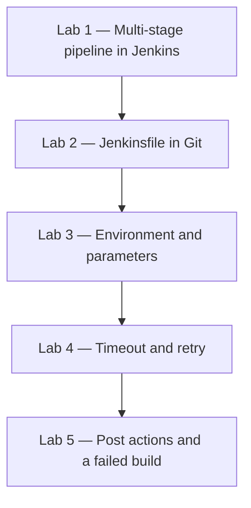

# Lab 03 — Jenkins Pipeline and Jenkinsfile Development

**Day 2**  
**Duration:** 4 hours  
**Hands-on:** about 2–2.5 hours  
**Labs:** 5  
**Level:** Beginner → Intermediate

Day 1 created a pipeline inside the Jenkins job. Today that pipeline moves into a `Jenkinsfile` in Git, then gains parameters, a timeout, retry, and post actions.

## Business scenario

QuickCart will not keep the Order Service pipeline only in the Jenkins screen. The DevOps team wants one workflow that is reviewed with the code, can target DEV, QA, or UAT without a separate file for each environment, and still reports a clear success or failure when something goes wrong.

You continue as a member of that team. Complete the five labs in order. Each one changes the same `Jenkinsfile`.



| Lab | What you produce | What it proves |
|---|---|---|
| 1 | Job `quickcart-day2-pipeline` | Several steps can live in each stage |
| 2 | `Jenkinsfile` in Git, job `quickcart-jenkinsfile-pipeline` | Jenkins runs the file from the repository |
| 3 | Parameters `ENVIRONMENT` and `RUN_TESTS` | One file serves DEV, QA, and UAT |
| 4 | `timeout` and `retry` | A hang stops, and a temporary failure can be tried again |
| 5 | `post` success, failure, and always | The log states the result, including after a failure |

## Prerequisites

Complete [Lab 02](Lab%2002%20-%20Jenkins%20and%20CI-CD%20Fundamentals.md), or be able to create a Pipeline job and read Console Output.

| Requirement | What you need |
|---|---|
| Jenkins | The controller from Lab 01, with at least one executor on the built-in node |
| Browser | Chrome, Edge, or Firefox |
| Git | `git --version` succeeds on the computer where you edit files |
| Editor | VS Code, IntelliJ, or any editor that can save a file named `Jenkinsfile` with no extension |
| Repository | A Git remote from your instructor, or a new empty repository you can push to |

Day 2 still uses `echo`. Maven starts on Day 3. Passwords and webhooks are not configured today. If the Git remote is private, you select a Jenkins credential in the job. You do not paste a password into the `Jenkinsfile`.

### Which version to follow

Creating the folder and running Git happens on **your computer**. The pipeline runs on the **Jenkins agent**.

| Where the step runs | Windows service Jenkins | Docker Jenkins, including Docker Desktop on Windows |
|---|---|---|
| Your computer: folder, `Jenkinsfile`, `git push` | PowerShell | PowerShell on a Windows PC, or Terminal on macOS or Linux. The Git commands are the same |
| Jenkins agent: the sleep inside the timeout lab | **Windows service setup** — `bat` | **Docker setup** — `sh` |

Labs 1, 3, and 5 use the same pipeline script on both agents. `echo`, `error`, `timeout`, and `retry` are Jenkins steps.

---

# Lab 1 — Build a Multi-Stage Declarative Pipeline

## Business scenario

The Day 1 pipeline showed Initialize, Build, Test, and Package. QuickCart now wants more than one action inside each stage, still without compiling the application.

## Same steps for both setups

`echo` is a Jenkins step. Paste this script on the Windows service and on the Docker controller.

## Objectives

- Create Pipeline job `quickcart-day2-pipeline`
- Put two steps in each stage
- Run it and find each message in Console Output

### Estimated time
20–25 minutes

### Difficulty
Beginner

---

## Step 1 — Create the pipeline job

On the dashboard, select **New Item**.

Name:

```text
quickcart-day2-pipeline
```

Select **Pipeline**, then **OK**.

If **Pipeline** is missing, install the Pipeline plugin from **Manage Jenkins → Plugins → Available plugins**, then create the job again.

## Step 2 — Add a description

If the configuration page shows **Description**, paste:

```text
QuickCart Day 2 Declarative Pipeline demonstrating
multiple Pipeline stages and steps.
```

If that box is not on the form, select **Save**, then **Add description** on the job page, and paste the same text.

## Step 3 — Choose Pipeline script

Open **Configure** if you are not already there.

At the bottom, in **Pipeline**, set **Definition** to **Pipeline script**.

This job still stores the script in Jenkins. Lab 2 moves it to Git.

## Step 4 — Enter the pipeline

```groovy
pipeline {

    agent any

    stages {

        stage('Initialize') {
            steps {
                echo 'Initializing QuickCart Pipeline'
                echo 'Preparing build environment'
            }
        }

        stage('Build') {
            steps {
                echo 'Building QuickCart application'
                echo 'Build completed'
            }
        }

        stage('Test') {
            steps {
                echo 'Running QuickCart tests'
                echo 'All tests passed'
            }
        }

        stage('Package') {
            steps {
                echo 'Creating QuickCart application package'
                echo 'Package created'
            }
        }
    }
}
```

## Step 5 — Read the structure before you run

```text
pipeline
│
├── agent any
│
└── stages
     ├── Initialize   (two echo steps)
     ├── Build        (two echo steps)
     ├── Test         (two echo steps)
     └── Package      (two echo steps)
```

## Step 6 — Save and run

Select **Save**, then **Build Now**.

## Step 7 — Confirm the stages

On the build page the graph should show Initialize, Build, Test, and Package in that order, all successful.

Open **Console Output** and find both messages from each stage. The build ends with `Finished: SUCCESS`.

## Lab 1 verification

| Check | Expected |
|---|---|
| Job | `quickcart-day2-pipeline` |
| Definition | Pipeline script |
| Each stage | Two echo lines in the log |
| Result | SUCCESS |

---

# Lab 2 — Move the Pipeline into a Jenkinsfile

## Business scenario

QuickCart does not want the delivery workflow stored only inside Jenkins. The pipeline must be versioned, reviewed, and kept next to the application. The team puts it in a file named `Jenkinsfile`.

## Objectives

- Create `quickcart-order-service` with a `Jenkinsfile`
- Push it to the training Git repository
- Point a new Jenkins job at that file
- Change one line, push, and see Jenkins run the new line

### Estimated time
25–30 minutes

### Difficulty
Beginner

### Dependency
Lab 1. You also need a Git remote you can push to.

---

## Step 1 — Create the project on your computer

The folder is created on your computer, not inside the Jenkins container or the Jenkins service.

### Windows computer, PowerShell

```powershell
mkdir quickcart-order-service
cd quickcart-order-service
New-Item -ItemType File -Name Jenkinsfile
New-Item -ItemType File -Name README.md
```

### macOS or Linux computer

```bash
mkdir quickcart-order-service
cd quickcart-order-service
touch Jenkinsfile README.md
```

The file name is exactly `Jenkinsfile`. It has no extension. If Windows saves `Jenkinsfile.txt`, Jenkins will not find the script. In the editor, choose **Save as** and set the type to **All files**.

The folder now looks like this:

```text
quickcart-order-service/
├── README.md
└── Jenkinsfile
```

## Step 2 — Write the Jenkinsfile

Put this in `Jenkinsfile` and save it:

```groovy
pipeline {

    agent any

    stages {

        stage('Initialize') {
            steps {
                echo 'Initializing QuickCart Pipeline'
            }
        }

        stage('Build') {
            steps {
                echo 'Building QuickCart application'
            }
        }

        stage('Test') {
            steps {
                echo 'Running QuickCart tests'
            }
        }

        stage('Package') {
            steps {
                echo 'Creating QuickCart package'
            }
        }
    }
}
```

## Step 3 — Write the README

```text
# QuickCart Order Service

Training project used to demonstrate Jenkins CI/CD.

Day 2:
- Declarative Pipeline
- Jenkinsfile
- Environment variables
- Parameters
- Timeout
- Retry
- Post actions
```

## Step 4 — Commit

Run these in `quickcart-order-service`. They are the same in PowerShell and in bash.

```bash
git init
git add .
git commit -m "Add initial QuickCart Jenkinsfile"
```

If Git refuses the commit because it has no name or email, set them for this repository only, then commit again:

```bash
git config user.name "Your Name"
git config user.email "you@example.com"
git commit -m "Add initial QuickCart Jenkinsfile"
```

Use the identity your instructor gave you when the class has one.

## Step 5 — Push

Replace the URL with the repository from your instructor.

```bash
git remote add origin <repository-url>
git branch -M main
git push -u origin main
```

The branch name must stay `main`. The Jenkins job in the next step looks for that branch.

Confirm the file is on the remote before you continue. The repository root contains `Jenkinsfile`, not a file inside another folder, unless your instructor told you to use a subfolder.

## Step 6 — Create the Jenkins job from SCM

Select **New Item**. Name it:

```text
quickcart-jenkinsfile-pipeline
```

Select **Pipeline**, then **OK**.

In the **Pipeline** section set:

| Field | Value |
|---|---|
| Definition | **Pipeline script from SCM** |
| SCM | **Git** |
| Repository URL | The same URL you pushed to |
| Credentials | **None** when the repository is public. For a private repository, select the Git username/password or SSH key your instructor created. Do not type the password into the Jenkinsfile |
| Branches to build | `*/main` |

Jenkins often fills **Branches to build** with `*/master`. Change it. A job left on `*/master` fails with “Couldn’t find any revision to build” because this lab pushed `main`.

| Field | Value |
|---|---|
| Script Path | `Jenkinsfile` |

Select **Save**.

## Step 7 — Run the job

Select **Build Now**.

Jenkins checks out the repository and runs the file. Console Output contains the checkout and then:

```text
Initializing QuickCart Pipeline
Building QuickCart application
Running QuickCart tests
Creating QuickCart package

Finished: SUCCESS
```

The workspace path depends on the agent.

| Setup | Typical workspace |
|---|---|
| Docker | `/var/jenkins_home/workspace/quickcart-jenkinsfile-pipeline` |
| Windows service | `C:\ProgramData\Jenkins\.jenkins\workspace\quickcart-jenkinsfile-pipeline` |

## Step 8 — Prove the job follows Git

On your computer, change this line in `Jenkinsfile`:

```groovy
echo 'Building QuickCart application'
```

to:

```groovy
echo 'Building QuickCart Order Service Version 2'
```

Commit and push:

```bash
git add Jenkinsfile
git commit -m "Update build stage"
git push
```

In Jenkins, select **Build Now** on `quickcart-jenkinsfile-pipeline`.

Console Output for this new build contains `Building QuickCart Order Service Version 2`. The previous build still shows the old message. Jenkins did not edit the file. It read the commit you pushed.

```text
Jenkinsfile changed
       ↓
Git
       ↓
Jenkins reads the latest Pipeline
       ↓
The new build prints the new message
```

## Lab 2 verification

| Check | Expected |
|---|---|
| Repository | `Jenkinsfile` on branch `main` |
| Job | `quickcart-jenkinsfile-pipeline` |
| Definition | Pipeline script from SCM |
| Branch | `*/main` |
| Second build | Prints `Version 2` |

### If checkout fails

| Console text | Correction |
|---|---|
| Couldn’t find any revision to build | Set **Branches to build** to `*/main` |
| `Jenkinsfile` not found | The file is not at the repository root, or it was saved as `Jenkinsfile.txt` |
| Authentication failed | Select the Git credential. Do not put the password in the Jenkinsfile |

---

# Lab 3 — Configure Environment Variables and Pipeline Parameters

## Business scenario

QuickCart deploys the same Order Service to DEV, QA, and UAT. The team will not keep three Jenkinsfiles. One file reads the application name from the environment and asks the person who starts the build which environment to use, and whether to run tests.

## Same Jenkinsfile for both setups

Edit the file on your computer, push it, and run `quickcart-jenkinsfile-pipeline`. The agent does not change these steps.

## Objectives

- Add `APP_NAME` and `APP_VERSION`
- Print Jenkins values `JOB_NAME`, `BUILD_NUMBER`, and `WORKSPACE`
- Add parameters `ENVIRONMENT` and `RUN_TESTS`
- Skip Test when `RUN_TESTS` is false

### Estimated time
25–30 minutes

### Difficulty
Intermediate

### Dependency
Lab 2. The job must already run the `Jenkinsfile` from Git.

---

## Step 1 — Add environment variables

Open `Jenkinsfile`. Immediately after `agent any`, add:

```groovy
environment {

    APP_NAME = 'quickcart-order-service'

    APP_VERSION = '1.0'
}
```

## Step 2 — Use them in Build

Replace the Build stage with:

```groovy
stage('Build') {

    steps {

        echo "Application: ${APP_NAME}"

        echo "Version: ${APP_VERSION}"

        echo "Jenkins Build Number: ${env.BUILD_NUMBER}"
    }
}
```

Double quotes are required. A single-quoted string would print `${APP_NAME}` instead of the value.

## Step 3 — Print built-in variables

Replace the Initialize stage with:

```groovy
stage('Initialize') {

    steps {

        echo "Job Name: ${env.JOB_NAME}"

        echo "Build Number: ${env.BUILD_NUMBER}"

        echo "Workspace: ${env.WORKSPACE}"
    }
}
```

`JOB_NAME` is `quickcart-jenkinsfile-pipeline`. `WORKSPACE` is the Docker path or the Windows path from Lab 2.

## Step 4 — Add parameters

After `agent any`, and beside the `environment` block, add:

```groovy
parameters {

    choice(
        name: 'ENVIRONMENT',
        choices: ['dev', 'qa', 'uat'],
        description: 'Select target environment'
    )

    booleanParam(
        name: 'RUN_TESTS',
        defaultValue: true,
        description: 'Execute application tests'
    )
}
```

`environment` and `parameters` are both direct children of `pipeline`. Either may come first.

## Step 5 — Print the parameter values

Inside Initialize, after the workspace line, add:

```groovy
echo "Target Environment: ${params.ENVIRONMENT}"

echo "Run Tests: ${params.RUN_TESTS}"
```

## Step 6 — Run Test only when asked

Replace the Test stage with:

```groovy
stage('Test') {

    when {

        expression {
            return params.RUN_TESTS
        }
    }

    steps {

        echo 'Running QuickCart tests'

        echo 'Tests completed successfully'
    }
}
```

When `RUN_TESTS` is false, Jenkins skips Test and still runs Package. A skip is not a failure.

## Step 7 — Commit and push

```bash
git add Jenkinsfile
git commit -m "Add environment variables and parameters"
git push
```

## Step 8 — Load the parameters, then run with them

Jenkins learns new `parameters` only after it has read the updated `Jenkinsfile`.

1. Open `quickcart-jenkinsfile-pipeline`.
2. If the button still says **Build Now**, run it once. That run loads the parameter definitions. Test may be skipped on this load run. That is expected.
3. The next button is **Build with Parameters**.
4. Set `ENVIRONMENT` to `dev` and `RUN_TESTS` to checked, then **Build**.

## Step 9 — Read the log

Console Output contains:

```text
Application: quickcart-order-service

Version: 1.0

Target Environment: dev

Run Tests: true
```

`Job Name` is the Jenkins job, not `APP_NAME`.

## Step 10 — Skip the tests

Select **Build with Parameters** again.

```text
ENVIRONMENT = qa
RUN_TESTS = false
```

Run it. The graph shows:

```text
Initialize ✓
Build ✓
Test — skipped
Package ✓
```

The log contains `Target Environment: qa` and does not contain `Running QuickCart tests`.

## Lab 3 challenge

Run once more with `ENVIRONMENT` = `uat` and `RUN_TESTS` checked. Compare the three builds. The Jenkinsfile did not change between them. The parameters did.

---

# Lab 4 — Add Timeout, Retry, and Basic Failure Handling

## Business scenario

Two QuickCart runs caused trouble. A test step hung until someone cancelled it. A package step failed once because a shared service blinked, then would have succeeded if it had been tried again.

The team adds a timeout around tests and a retry around packaging.

## Objectives

- Stop Test if it runs longer than the timeout
- See that timeout in the console
- Retry Package and watch a simulated failure succeed on the third attempt

### Estimated time
25–30 minutes

### Difficulty
Intermediate

### Dependency
Lab 3. Keep `RUN_TESTS` checked for this lab so Test actually runs.

---

## Part A — Timeout

## Step 1 — Wrap Test

Replace the steps inside Test with:

```groovy
stage('Test') {

    when {

        expression {
            return params.RUN_TESTS
        }
    }

    steps {

        timeout(time: 2, unit: 'MINUTES') {

            echo 'Running QuickCart tests'

            echo 'Tests completed'
        }
    }
}
```

Commit, push, and run with `RUN_TESTS` checked. The build succeeds. Two minutes is longer than these echo steps need.

```bash
git add Jenkinsfile
git commit -m "Add test timeout"
git push
```

## Step 2 — Force the timeout

Change the limit to 5 seconds and add a 10-second wait inside the same `timeout` block. Use the wait that matches the Jenkins agent.

### Docker setup

The agent is Linux, including Docker Desktop on a Windows PC.

```groovy
timeout(time: 5, unit: 'SECONDS') {

    echo 'Running QuickCart tests'

    sh 'sleep 10'
}
```

### Windows service setup

The agent is Windows. `timeout /t` often returns immediately under Jenkins because the batch step has no console. Use `Start-Sleep` instead.

```groovy
timeout(time: 5, unit: 'SECONDS') {

    echo 'Running QuickCart tests'

    bat 'powershell -Command "Start-Sleep -Seconds 10"'
}
```

Put only one of those blocks in the file. A `sh` step on the Windows service fails with `Cannot run program "sh"`. A `bat` step in the Docker image fails because the container has no `bat`.

Commit, push, and run with tests enabled.

```bash
git add Jenkinsfile
git commit -m "Demonstrate test timeout"
git push
```

The Test stage stops at about five seconds. Console Output contains `Timeout has been exceeded`. The build result is **ABORTED**. Later stages do not run.

## Step 3 — Restore Test

Remove the sleep. Put the two-minute timeout back:

```groovy
timeout(time: 2, unit: 'MINUTES') {

    echo 'Running QuickCart tests'

    echo 'Tests completed'
}
```

Commit and push before Part C. A later success run cannot pass while the five-second sleep is still in the file.

```bash
git add Jenkinsfile
git commit -m "Restore test timeout"
git push
```

---

## Part B — Retry

## Step 4 — Retry Package

Replace Package with:

```groovy
stage('Package') {

    steps {

        retry(3) {

            echo 'Creating QuickCart application package'
        }
    }
}
```

Run the pipeline. It succeeds on the first attempt. Retry does nothing when the steps succeed. You will not see three package lines yet.

## Step 5 — Fail twice, then succeed

At the top of `Jenkinsfile`, above `pipeline`, add:

```groovy
def attempt = 0
```

Replace Package with:

```groovy
stage('Package') {

    steps {

        retry(3) {

            script {

                attempt++

                echo "Package attempt: ${attempt}"

                if (attempt < 3) {

                    error 'Simulated temporary packaging failure'
                }

                echo 'Package created successfully'
            }
        }
    }
}
```

Commit, push, and run.

Console Output follows this sequence:

```text
Package attempt: 1
Simulated temporary packaging failure

Package attempt: 2
Simulated temporary packaging failure

Package attempt: 3
Package created successfully
```

The stage ends successfully because the third attempt did not call `error`. The pipeline result is SUCCESS.

Retry is for an operation that can fail and then succeed, such as a brief network error. It does not repair a compile error. Leave a real defect failing so someone fixes it.

## Step 6 — Remove the simulated failure

Lab 5 needs a package stage that succeeds on the first attempt. Delete `def attempt = 0` and restore Package to:

```groovy
stage('Package') {

    steps {

        retry(3) {

            echo 'Creating QuickCart application package'
        }
    }
}
```

Commit and push:

```bash
git add Jenkinsfile
git commit -m "Remove simulated package retry failure"
git push
```

---

# Lab 5 — Add Post Actions and Handle a Failed Build

## Business scenario

QuickCart wants every run to say whether it succeeded or failed, and to print the job and build number even when the run fails. That closing work belongs in `post`, because steps inside a failed stage do not continue.

## Same script for both setups

`post` and `error` are Jenkins steps. Use one Jenkinsfile on either agent.

## Objectives

- Add `success`, `failure`, and `always`
- See `success` and `always` on a good run
- Fail Build on purpose and see `failure` and `always` instead
- Remove the failure and finish green

### Estimated time
30–35 minutes

### Difficulty
Intermediate

### Dependency
Lab 4 Step 6. Package no longer contains the attempt counter.

---

## Step 1 — Add post

After the closing brace of `stages`, and still inside `pipeline`, add:

```groovy
post {

    success {

        echo '================================='

        echo 'QuickCart Pipeline SUCCESS'

        echo '================================='
    }

    failure {

        echo '================================='

        echo 'QuickCart Pipeline FAILED'

        echo '================================='
    }

    always {

        echo "Job: ${env.JOB_NAME}"

        echo "Build: ${env.BUILD_NUMBER}"

        echo 'Pipeline execution completed'
    }
}
```

The shape is:

```text
pipeline {
    agent any
    parameters { }
    environment { }
    stages { }
    post { }
}
```

## Step 2 — Commit and run a success

```bash
git add Jenkinsfile
git commit -m "Add Pipeline post actions"
git push
```

**Build with Parameters:** `ENVIRONMENT` = `dev`, `RUN_TESTS` checked.

The log ends with:

```text
QuickCart Pipeline SUCCESS

Job: quickcart-jenkinsfile-pipeline
Build: <this build number>
Pipeline execution completed

Finished: SUCCESS
```

`failure` does not run on this build.

## Step 3 — Fail the Build stage

Replace Build with:

```groovy
stage('Build') {

    steps {

        echo "Building ${APP_NAME}"

        error 'Simulated QuickCart build failure'
    }
}
```

Commit and push:

```bash
git add Jenkinsfile
git commit -m "Simulate build failure"
git push
```

Run again with tests checked.

```text
Initialize ✓
Build ✕
Test skipped
Package skipped
```

The log contains `Simulated QuickCart build failure`, then:

```text
QuickCart Pipeline FAILED

Pipeline execution completed

Finished: FAILURE
```

`success` does not run. `failure` runs because the pipeline failed. `always` runs either way. Test and Package do not run, for the same reason Package stopped on Day 1 when Test failed.

Record:

```text
Failed stage:     Build
Failure:          Simulated QuickCart build failure
Pipeline result:  FAILURE
Post actions:     failure and always
```

## Step 4 — Restore Build

Remove the `error` line. Leave Build as:

```groovy
stage('Build') {

    steps {

        echo "Building ${APP_NAME}"

        echo "Version ${APP_VERSION}"
    }
}
```

Commit, push, and run once more:

```bash
git add Jenkinsfile
git commit -m "Fix simulated build failure"
git push
```

```text
Initialize ✓
Build ✓
Test ✓
Package ✓

QuickCart Pipeline SUCCESS
Pipeline execution completed
```

## Lab 5 verification

| Run | Post blocks that print |
|---|---|
| Successful build | `success` and `always` |
| Failed Build stage | `failure` and `always` |
| After the fix | `success` and `always` |

---

# Day 2 Jenkinsfile

After Lab 5 the file should match this. The sleep and the attempt counter are no longer in it.

```groovy
pipeline {

    agent any

    parameters {

        choice(
            name: 'ENVIRONMENT',
            choices: ['dev', 'qa', 'uat'],
            description: 'Select target environment'
        )

        booleanParam(
            name: 'RUN_TESTS',
            defaultValue: true,
            description: 'Execute application tests'
        )
    }

    environment {

        APP_NAME = 'quickcart-order-service'

        APP_VERSION = '1.0'
    }

    stages {

        stage('Initialize') {

            steps {

                echo "Job: ${env.JOB_NAME}"

                echo "Build: ${env.BUILD_NUMBER}"

                echo "Workspace: ${env.WORKSPACE}"

                echo "Target: ${params.ENVIRONMENT}"

                echo "Run Tests: ${params.RUN_TESTS}"
            }
        }

        stage('Build') {

            steps {

                echo "Building ${APP_NAME}"

                echo "Version ${APP_VERSION}"
            }
        }

        stage('Test') {

            when {

                expression {
                    return params.RUN_TESTS
                }
            }

            steps {

                timeout(time: 2, unit: 'MINUTES') {

                    echo 'Running QuickCart tests'

                    echo 'Tests completed successfully'
                }
            }
        }

        stage('Package') {

            steps {

                retry(3) {

                    echo 'Creating QuickCart application package'
                }
            }
        }
    }

    post {

        success {

            echo 'QuickCart Pipeline SUCCESS'
        }

        failure {

            echo 'QuickCart Pipeline FAILED'
        }

        always {

            echo "Build ${env.BUILD_NUMBER} completed"
        }
    }
}
```

---

# Day 2 final challenge

QuickCart wants a second pipeline for the Payment Service. Create a new folder and repository, or a new Jenkins job and Jenkinsfile, named around:

```text
quickcart-payment-service
```

Do not paste the Order Service file unchanged.

Stages:

```text
Initialize → Build → Security Check → Test → Package
```

Include:

| Item | Value |
|---|---|
| `APP_NAME` | `quickcart-payment-service` |
| `APP_VERSION` | `1.0` |
| Parameter | `ENVIRONMENT` choices `dev`, `qa`, `uat` |
| Test | A timeout |
| Package | A retry |
| `post` | `success`, `failure`, and `always` |

Push the file and run it from **Pipeline script from SCM** on branch `*/main`.

Then fail **Security Check** with `error`. Confirm the stages after it do not run, and confirm `failure` and `always` print. Remove the `error`, push, and rerun until the result is SUCCESS.

Use `sh` only on the Docker agent and `bat` only on the Windows service if you add a wait. The challenge does not require a wait.

---

# Day 2 completion checklist

| # | Lab | Outcome |
|---:|---|---|
| 1 | Multi-stage pipeline | `quickcart-day2-pipeline` runs four stages with two steps each |
| 2 | Jenkinsfile | `quickcart-jenkinsfile-pipeline` runs the file from Git `main` |
| 3 | Variables and parameters | DEV, QA, and UAT come from **Build with Parameters**, and Test can be skipped |
| 4 | Timeout and retry | A five-second timeout stops a ten-second wait, and retry succeeds on the third attempt |
| 5 | Post actions | Success and failure each print the matching block, and `always` prints both times |
| Challenge | Payment Service | A second Jenkinsfile fails Security Check, then succeeds |

Day 3 replaces the echo steps with a Maven build of this same Order Service. Continue with [Lab 04 — SCM Integration, Builds, and Quality](Lab%2004%20-%20SCM%20Integration%20Builds%20and%20Quality.md).
