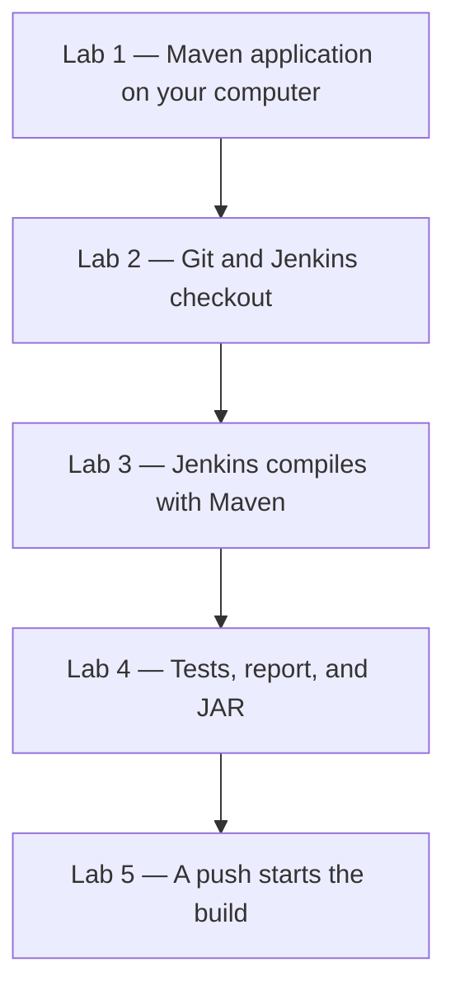

# Lab 04 — SCM Integration, Builds, and Quality

**Day 3**  
**Duration:** 4 hours  
**Hands-on:** about 2–2.5 hours  
**Labs:** 5  
**Level:** Intermediate

Day 2 ran a `Jenkinsfile` of `echo` steps. Today that file builds the QuickCart Order Service with Maven, publishes the unit-test result, and archives the JAR. A push to Git starts the pipeline.

## Business scenario

QuickCart’s Order Service is still a set of messages in Jenkins. Two developers can produce two different results on two laptops, and nobody has a JAR that Jenkins can trace back to a commit.

The team wants one path:

```text
Developer
    ↓
Git
    ↓
Jenkins checkout
    ↓
Maven compile
    ↓
Unit tests and a published report
    ↓
Package
    ↓
Archived JAR
```

You add that application to the Day 2 repository and point a new job, `quickcart-order-ci`, at it.



## Prerequisites

Complete [Lab 03](Lab%2003%20-%20Jenkins%20Pipeline%20and%20Jenkinsfile%20Development.md), or be able to push a `Jenkinsfile` and run it with **Pipeline script from SCM**.

| Requirement | What you need |
|---|---|
| Jenkins | The controller from Lab 01, with at least one executor |
| JDK | 21 on your computer. Lab 01 installed it. Java 21 can compile the Java 17 source in this lab |
| Maven | 3.9 or later on your computer, for Lab 1 only |
| Git | The Day 2 remote, or a new empty repository |
| Editor | VS Code or IntelliJ |

Check your computer:

```powershell
java -version
mvn -version
git --version
```

`java -version` should report 21. `mvn -version` should report 3.9 or later and the same Java.

If `mvn` is not found, install Maven on your computer before Lab 1. This install is for your terminal. The Jenkins agent gets Maven separately in the section below.

**Windows.** Download the Maven 3.9 binary zip from Apache, extract it to `C:\tools\apache-maven-3.9.9`, and add `C:\tools\apache-maven-3.9.9\bin` to your user `Path`. Open a new PowerShell window and run `mvn -version` again.

**macOS or Linux.** Install Maven 3.9 with the package manager you already use, then run `mvn -version`.

### Maven on the Jenkins agent

Installing Maven on your laptop does not install it inside the Jenkins Docker container, and the Windows service often cannot see your user `Path`. Register Maven once in Jenkins. Both agents then download it into `JENKINS_HOME`.

1. Open **Manage Jenkins → Tools**.
2. Under **Maven**, select **Add Maven**.
3. Name it exactly `Maven-3.9`.
4. Select **Install automatically** and choose a 3.9 version.
5. Select **Save**.

Every Jenkinsfile from Lab 3 onward includes:

```groovy
tools {
    maven 'Maven-3.9'
}
```

The name must match the tool you created. Jenkins then puts `mvn` on the agent `PATH` for that build.

The Docker image already contains Java. On the Windows service, Maven still needs Java 21. If a later build says `JAVA_HOME` is not set, set the system `JAVA_HOME` to the JDK 21 folder from Lab 01 and restart the Jenkins service.

### Which version to follow

| Where the step runs | Windows service | Docker, including Docker Desktop on Windows |
|---|---|---|
| Your computer: files, `mvn`, `git push` | PowerShell | PowerShell, or Terminal on macOS or Linux. The Git and Maven commands are the same |
| Jenkins agent: the build commands | **Windows service setup** — `bat 'mvn ...'` | **Docker setup** — `sh 'mvn ...'` |

`junit`, `archiveArtifacts`, and `echo` are the same on both agents.

---

# Lab 1 — Create and Test the QuickCart Maven Application

## Business scenario

The Jenkinsfile proves Jenkins can run stages. It does not prove the Order Service calculates an order total. You create that class and a JUnit test on your computer before Jenkins is allowed to build it.

## Objectives

- Add a Maven project to `quickcart-order-service`
- Compile, test, and package it locally
- Find the JAR and the Surefire report

### Estimated time
25–30 minutes

### Difficulty
Intermediate

---

## Step 1 — Open or create the project

If Lab 03 created `quickcart-order-service`, use that folder. Do not create a second copy.

If you are starting today, create the folder:

```powershell
mkdir quickcart-order-service
cd quickcart-order-service
```

Create the source folders.

**Windows PowerShell**, from inside the project:

```powershell
mkdir src\main\java\com\quickcart -Force
mkdir src\test\java\com\quickcart -Force
```

**macOS or Linux:**

```bash
mkdir -p src/main/java/com/quickcart src/test/java/com/quickcart
```

The tree you are building is:

```text
quickcart-order-service/
├── pom.xml
├── Jenkinsfile
└── src/
    ├── main/java/com/quickcart/OrderCalculator.java
    └── test/java/com/quickcart/OrderCalculatorTest.java
```

The Day 2 `Jenkinsfile` and `README.md` can stay for now. Lab 2 replaces the pipeline.

## Step 2 — Create `pom.xml`

The compiler source is 17. JDK 21 on your computer compiles that source.

```xml
<project xmlns="http://maven.apache.org/POM/4.0.0"
         xmlns:xsi="http://www.w3.org/2001/XMLSchema-instance"
         xsi:schemaLocation="http://maven.apache.org/POM/4.0.0
         https://maven.apache.org/xsd/maven-4.0.0.xsd">

    <modelVersion>4.0.0</modelVersion>

    <groupId>com.quickcart</groupId>
    <artifactId>quickcart-order-service</artifactId>
    <version>1.0.0</version>

    <properties>
        <maven.compiler.source>17</maven.compiler.source>
        <maven.compiler.target>17</maven.compiler.target>
        <project.build.sourceEncoding>UTF-8</project.build.sourceEncoding>
        <junit.version>5.10.2</junit.version>
    </properties>

    <dependencies>

        <dependency>
            <groupId>org.junit.jupiter</groupId>
            <artifactId>junit-jupiter</artifactId>
            <version>${junit.version}</version>
            <scope>test</scope>
        </dependency>

    </dependencies>

    <build>

        <plugins>

            <plugin>
                <groupId>org.apache.maven.plugins</groupId>
                <artifactId>maven-surefire-plugin</artifactId>
                <version>3.2.5</version>
            </plugin>

        </plugins>

    </build>

</project>
```

## Step 3 — Create the order calculator

`src/main/java/com/quickcart/OrderCalculator.java`

```java
package com.quickcart;

public class OrderCalculator {

    public double calculateTotal(double price, int quantity) {

        if (price < 0) {
            throw new IllegalArgumentException(
                "Price cannot be negative"
            );
        }

        if (quantity < 0) {
            throw new IllegalArgumentException(
                "Quantity cannot be negative"
            );
        }

        return price * quantity;
    }
}
```

## Step 4 — Create the unit test

`src/test/java/com/quickcart/OrderCalculatorTest.java`

```java
package com.quickcart;

import org.junit.jupiter.api.Test;

import static org.junit.jupiter.api.Assertions.assertEquals;

class OrderCalculatorTest {

    @Test
    void shouldCalculateOrderTotal() {

        OrderCalculator calculator =
                new OrderCalculator();

        double total =
                calculator.calculateTotal(100.0, 2);

        assertEquals(200.0, total);
    }
}
```

## Step 5 — Compile, test, and package

From `quickcart-order-service` in PowerShell or bash:

```bash
mvn clean compile
```

Expect `BUILD SUCCESS`.

```bash
mvn test
```

Expect:

```text
Tests run: 1
Failures: 0
Errors: 0

BUILD SUCCESS
```

```bash
mvn package
```

Expect `BUILD SUCCESS` and this file:

```text
target/quickcart-order-service-1.0.0.jar
```

On Windows the same file is `target\quickcart-order-service-1.0.0.jar`.

Open `target/surefire-reports/`. Surefire wrote XML reports there. Lab 4 publishes those files in Jenkins. Do not commit the `target` directory.

## Lab 1 verification

| Check | Expected |
|---|---|
| `mvn test` | 1 test, 0 failures |
| JAR | `quickcart-order-service-1.0.0.jar` |
| Reports | XML files under `target/surefire-reports` |

---

# Lab 2 — Store the Application in Git and Check It Out from Jenkins

## Business scenario

QuickCart will not copy source files onto the Jenkins machine by hand. Git is the source. Jenkins checks out that repository, including `pom.xml` and the `Jenkinsfile`.

## Objectives

- Keep `target/` out of Git
- Push `main`
- Run job `quickcart-order-ci` from that `Jenkinsfile`

### Estimated time
25–30 minutes

### Difficulty
Intermediate

---

## Step 1 — Ignore build output

Create `.gitignore` in the project root:

```text
target/
.idea/
*.iml
.vscode/
```

## Step 2 — Commit and push

**Continuing the Day 2 repository.** Do not run `git init` again. From the project folder:

```bash
git add .
git commit -m "Add QuickCart Order Service"
git push
```

**New repository.** Run `git init`, then the same add and commit. Point `origin` at the instructor URL and push `main`:

```bash
git remote add origin <repository-url>
git branch -M main
git push -u origin main
```

If Git has no name or email yet, set them for this repository only, as in Lab 03, and commit again.

`git status` must not list files under `target/`.

## Step 3 — Confirm the remote

The repository root in the browser contains:

```text
src/
.gitignore
pom.xml
Jenkinsfile
README.md
```

`target/` is absent.

## Step 4 — Replace the Jenkinsfile with a checkout check

The Day 2 file still echoes. Replace its contents with this file. It is the same on both agents.

```groovy
pipeline {

    agent any

    stages {

        stage('Checkout Verification') {

            steps {

                echo 'Source code successfully loaded from SCM'

                echo "Workspace: ${env.WORKSPACE}"
            }
        }
    }
}
```

Push it:

```bash
git add Jenkinsfile
git commit -m "Add Jenkins Pipeline"
git push
```

## Step 5 — Create the CI job

Select **New Item**, name it `quickcart-order-ci`, choose **Pipeline**, and select **OK**.

In **Pipeline** set:

| Field | Value |
|---|---|
| Definition | **Pipeline script from SCM** |
| SCM | **Git** |
| Repository URL | The URL you pushed |
| Credentials | **None** for a public repository. For a private repository, select the Git credential. Do not put the password in the Jenkinsfile |
| Branches to build | `*/main` |
| Script Path | `Jenkinsfile` |

Change `*/master` if Jenkins filled that in. Select **Save**.

Leave the Day 2 job `quickcart-jenkinsfile-pipeline` without a new trigger. This day’s work uses `quickcart-order-ci`.

## Step 6 — Run and read the checkout

Select **Build Now**. Console Output shows a Git checkout, then:

```text
Source code successfully loaded from SCM
```

The workspace path is:

| Setup | Workspace |
|---|---|
| Docker | `/var/jenkins_home/workspace/quickcart-order-ci` |
| Windows service | `C:\ProgramData\Jenkins\.jenkins\workspace\quickcart-order-ci` |

Jenkins read the repository. It has not compiled the Java yet.

### If checkout fails

| Console text | Correction |
|---|---|
| Couldn’t find any revision to build | Set **Branches to build** to `*/main` |
| `Jenkinsfile` not found | The file is not at the repository root, or it was saved as `Jenkinsfile.txt` |
| Authentication failed | Select the Git credential |

---

# Lab 3 — Build the Maven Application with Jenkins

## Business scenario

A local `mvn compile` only proves one computer. QuickCart wants every commit compiled by Jenkins with the same Maven version.

## Objectives

- Run `mvn clean compile` on the agent
- Read a compile error from Console Output
- Fix the source, push, and see Build succeed

### Estimated time
20–25 minutes

### Difficulty
Intermediate

---

## Step 1 — Register Maven if you have not

Complete **Maven on the Jenkins agent** in the prerequisites. The tool name is `Maven-3.9`.

## Step 2 — Replace the Jenkinsfile

Use one version. `tools` is the same. The Maven step is not.

### Docker setup

```groovy
pipeline {

    agent any

    tools {
        maven 'Maven-3.9'
    }

    environment {
        APP_NAME = 'quickcart-order-service'
    }

    stages {

        stage('Build') {

            steps {

                echo "Building ${APP_NAME}"

                sh 'mvn clean compile'
            }
        }
    }

    post {

        success {
            echo 'QuickCart Maven build successful'
        }

        failure {
            echo 'QuickCart Maven build failed'
        }
    }
}
```

### Windows service setup

```groovy
pipeline {

    agent any

    tools {
        maven 'Maven-3.9'
    }

    environment {
        APP_NAME = 'quickcart-order-service'
    }

    stages {

        stage('Build') {

            steps {

                echo "Building ${APP_NAME}"

                bat 'mvn clean compile'
            }
        }
    }

    post {

        success {
            echo 'QuickCart Maven build successful'
        }

        failure {
            echo 'QuickCart Maven build failed'
        }
    }
}
```

`sh` on the Windows service fails with `Cannot run program "sh"`. `bat` in the Docker image fails because the container has no `bat`.

## Step 3 — Push and build

```bash
git add Jenkinsfile
git commit -m "Add Maven build stage"
git push
```

Open `quickcart-order-ci` and select **Build Now**.

The first run can take longer while Jenkins downloads Maven into the tool directory. Console Output then shows the Maven phases `clean`, `resources`, and `compile`, then `BUILD SUCCESS` and `QuickCart Maven build successful`.

## Step 4 — Break the compile on purpose

In `OrderCalculator.java`, remove the semicolon:

```java
return price * quantity
```

Commit, push, and build:

```bash
git add .
git commit -m "Introduce compilation failure for training"
git push
```

The Build stage fails. Console Output contains a Java compiler error from Maven, then `QuickCart Maven build failed`. Jenkins did not invent the error. Maven compiled the file Jenkins had checked out, and Jenkins reported the non-zero exit.

## Step 5 — Restore the source

```java
return price * quantity;
```

```bash
git add .
git commit -m "Fix compilation failure"
git push
```

Run the job again. Build succeeds.

---

# Lab 4 — Run Unit Tests, Publish Results, and Archive the Artifact

## Business scenario

A compile is not a release candidate. QuickCart requires the unit test to pass, the test report to be visible in Jenkins, and the same JAR to be kept with the build. If the test fails, Package does not run.

## Objectives

- Add Test and Package stages
- Publish `target/surefire-reports/*.xml`
- Archive `quickcart-order-service-1.0.0.jar` and fingerprint it
- Fail the test, confirm Package is skipped, then fix it

### Estimated time
30–35 minutes

### Difficulty
Intermediate

---

## Step 1 — Replace the Jenkinsfile

Keep `tools` and use the Maven step for your agent in all three stages.

### Docker setup

```groovy
pipeline {

    agent any

    tools {
        maven 'Maven-3.9'
    }

    environment {
        APP_NAME = 'quickcart-order-service'
    }

    stages {

        stage('Build') {

            steps {
                echo "Building ${APP_NAME}"
                sh 'mvn clean compile'
            }
        }

        stage('Test') {

            steps {
                echo 'Running unit tests'
                sh 'mvn test'
            }
        }

        stage('Package') {

            steps {
                echo 'Packaging application'
                sh 'mvn package -DskipTests'
            }
        }
    }

    post {

        always {

            junit(
                allowEmptyResults: true,
                testResults: 'target/surefire-reports/*.xml'
            )
        }

        success {

            archiveArtifacts(
                artifacts: 'target/*.jar',
                fingerprint: true
            )

            echo 'QuickCart CI Pipeline SUCCESS'
        }

        failure {
            echo 'QuickCart CI Pipeline FAILED'
        }
    }
}
```

### Windows service setup

Use the same pipeline and replace each `sh` step with:

```groovy
bat 'mvn clean compile'
bat 'mvn test'
bat 'mvn package -DskipTests'
```

`mvn package -DskipTests` packages the JAR without running the tests a second time. The Test stage already ran them. `-DskipTests` does not skip compilation.

`junit` reads the same Surefire path on Windows and Linux. `allowEmptyResults: true` lets a compile failure finish the `post` block when no XML report exists.

If the build fails with `No such DSL method 'junit'`, install the **JUnit** plugin from **Manage Jenkins → Plugins** and run again. Suggested plugins normally include it.

## Step 2 — Push and run

```bash
git add Jenkinsfile
git commit -m "Add tests and artifact archiving"
git push
```

Select **Build Now**. Expect:

```text
Build ✓
Test ✓
Package ✓
```

## Step 3 — Open the test result and the JAR

Open the successful build.

**Test Result** shows one test, `shouldCalculateOrderTotal`, with no failure. The numbers come from `target/surefire-reports/*.xml`.

**Build Artifacts** lists `quickcart-order-service-1.0.0.jar`. Fingerprinting records a checksum for that file so a later build can be matched to this JAR. The artifact is on the build page, not committed to Git.

## Step 4 — Fail the test

In `OrderCalculatorTest.java` change the expected total:

```java
assertEquals(300.0, total);
```

The calculator still returns 200. Commit, push, and build.

```text
Build ✓
Test ✕
Package skipped
```

Console Output shows a test failure: expected 300, actual 200. **Test Result** shows the failed test. Package did not run, so this build has no archived JAR. `post` still prints `QuickCart CI Pipeline FAILED`.

## Step 5 — Restore the test

```java
assertEquals(200.0, total);
```

Commit, push, and build. Build, Test, and Package succeed, and the JAR is archived again.

---

# Lab 5 — Start the Pipeline from a Git Push

## Business scenario

The pipeline works when someone selects **Build Now**. QuickCart wants a push to `main` to start the same build, test, and package flow.

Two mechanisms do that. Use the one that matches where Jenkins runs.

| Your Jenkins | What can reach GitHub or your Git server | Version to follow |
|---|---|---|
| Windows service or Docker on your own computer | Jenkins can call out. GitHub cannot call back to `localhost` | **Polling** |
| Instructor Jenkins with a URL the Git host can reach | The Git host can POST to Jenkins | **Webhook** |

## Objectives

- Explain polling and a webhook
- Start one build without **Build Now**
- Read the build cause

### Estimated time
25–30 minutes

### Difficulty
Intermediate

---

## Polling — local Windows service or local Docker

Jenkins asks the repository, on a schedule, whether `main` moved. Your PC can do this because the call goes out to Git.

1. Open `quickcart-order-ci` and select **Configure**.
2. Under **Build Triggers**, select **Poll SCM**.
3. Schedule:

```text
H/2 * * * *
```

That checks about every two minutes. The `H` spreads jobs so they do not all poll in the same second. This schedule is for the lab. A shared server should use a slower poll, such as `H/15 * * * *`, or a webhook.

4. Select **Save**.

## Webhook — Jenkins is reachable from the Git host

1. Install the **GitHub** plugin if the job has no GitHub trigger. Other Git hosts use the plugin and URL your instructor names.
2. In the job, under **Build Triggers**, select **GitHub hook trigger for GITScm polling**.
3. In the Git host, add a webhook for push events. For GitHub the payload URL is:

```text
http://<jenkins-host>/github-webhook/
```

Use the HTTPS URL when the instructor’s Jenkins is on HTTPS. Content type `application/json`.

4. Save the webhook and confirm the Git host shows a successful delivery. A delivery to `localhost` from GitHub fails. Use polling in that case.

## Step 1 — Push a real change and do not press Build Now

Add this method to `OrderCalculator.java`, inside the class:

```java
public double calculateTax(
        double orderTotal,
        double taxRate) {

    return orderTotal * taxRate;
}
```

Commit and push:

```bash
git add .
git commit -m "Add tax calculation"
git push
```

Do not select **Build Now**.

## Step 2 — Watch Jenkins

Polling starts a build within about two minutes. A webhook starts it after the Git host delivers the event.

```text
git push
    ↓
Poll or webhook
    ↓
Build ✓
    ↓
Test ✓
    ↓
Package ✓
```

Open the new build. The cause is an SCM change, not a manual start. On the build page that appears as **Started by an SCM change**, or in the console as a poll or hook. **Started by user** means someone still clicked **Build Now**.

---

# Optional — Multibranch Pipeline

A Multibranch Pipeline job scans the repository and runs the `Jenkinsfile` on each branch it finds. Create a branch to see the idea. You do not need a second full CI configuration today.

```bash
git checkout -b feature/order-discount
git push -u origin feature/order-discount
```

```text
Repository
├── main
│     └── Jenkinsfile
└── feature/order-discount
      └── Jenkinsfile
```

The job you have, `quickcart-order-ci`, still builds `main` only.

---

# Quality gate

A green compile is not the organization’s quality bar. A quality gate adds conditions after the unit tests and before the package is trusted, often through SonarQube:

```text
Checkout → Build → Unit tests → Analysis → Quality gate → Package
```

The gate can fail the pipeline for bugs, vulnerabilities, code smells, duplication, or coverage below the team’s limit. This course does not install SonarQube. The test stage you already have is the gate for this lab: a failed test does not produce an archived JAR.

---

# Day 3 challenge

Start from a green `quickcart-order-ci` build that has an archived JAR.

Change the test expectation again so the test fails. Commit and push. Do not select **Build Now**. Wait for the poll or the webhook.

Record:

```text
Build number:
Triggered by:
Failed stage:
Failed test:
Expected value:
Actual value:
Package executed?
Artifact archived?
```

Restore `assertEquals(200.0, total)`, push, and wait for the next automatic build. The result is Build, Test, Package, a published test report, and an archived JAR.

---

# Day 3 Jenkinsfile

Keep the version that matches the agent. The `tools` name stays `Maven-3.9`.

### Docker setup

```groovy
pipeline {

    agent any

    tools {
        maven 'Maven-3.9'
    }

    environment {
        APP_NAME = 'quickcart-order-service'
    }

    stages {

        stage('Build') {
            steps {
                echo "Building ${APP_NAME}"
                sh 'mvn clean compile'
            }
        }

        stage('Test') {
            steps {
                echo 'Running unit tests'
                sh 'mvn test'
            }
        }

        stage('Package') {
            steps {
                echo 'Packaging application'
                sh 'mvn package -DskipTests'
            }
        }
    }

    post {

        always {
            junit(
                allowEmptyResults: true,
                testResults: 'target/surefire-reports/*.xml'
            )
        }

        success {
            archiveArtifacts(
                artifacts: 'target/*.jar',
                fingerprint: true
            )
            echo 'QuickCart CI Pipeline SUCCESS'
        }

        failure {
            echo 'QuickCart CI Pipeline FAILED'
        }
    }
}
```

### Windows service setup

Use the same file with these three steps:

```groovy
bat 'mvn clean compile'
bat 'mvn test'
bat 'mvn package -DskipTests'
```

---

# Day 3 completion checklist

| # | Lab | Outcome |
|---:|---|---|
| 1 | Maven application | `mvn test` passes locally and the JAR exists under `target` |
| 2 | Git and SCM | `quickcart-order-ci` checks out `main` and prints the workspace |
| 3 | Maven on Jenkins | A missing semicolon fails the build, and restoring it succeeds |
| 4 | Tests and artifact | Test Result shows the test, and the build page stores the fingerprinted JAR |
| 5 | Trigger | A push starts a build without **Build Now** |
| Challenge | Break and repair | The failed test skips Package, and the fix archives a new JAR |

Day 4 publishes that JAR to Artifactory and deploys the same file after approval. Continue with [Lab 05 — Credentials, Artifactory, and Deployment](Lab%2005%20-%20Credentials%20Artifactory%20and%20Deployment.md).
