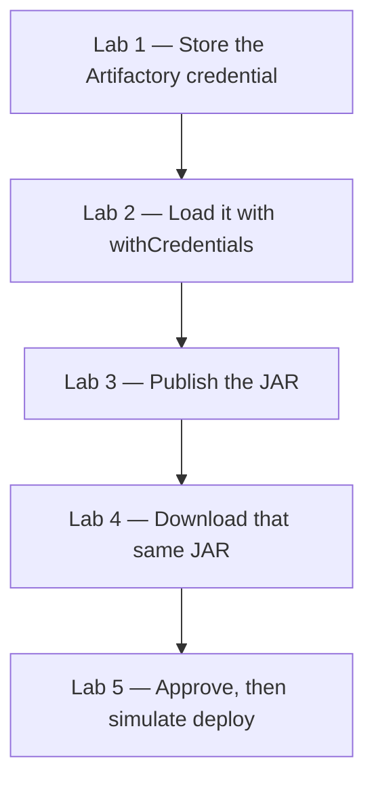

# Lab 05 — Credentials, Artifactory, and Deployment

**Day 4**  
**Duration:** 4 hours  
**Hands-on:** about 2–2.5 hours  
**Labs:** 5  
**Level:** Intermediate

Day 3 archived the Order Service JAR on the Jenkins build. Today that same JAR is published to JFrog Artifactory, downloaded back, and deployed only after a person approves. The password stays in Jenkins. It is not written in the `Jenkinsfile`.

## Business scenario

QuickCart can build and test the Order Service. The JAR still lives only on the Jenkins build that created it. The next environment would be tempted to compile again, and the Artifactory password must not sit in Git.

The delivery path is:

```text
Git
  ↓
Build, test, and package once
  ↓
Publish that JAR to Artifactory
  ↓
Download that same JAR
  ↓
Approval
  ↓
Simulated deploy to DEV, QA, or UAT
```

You continue with the Day 3 job `quickcart-order-ci` and the `quickcart-order-service` repository.



## Prerequisites

Complete [Lab 04](Lab%2004%20-%20SCM%20Integration%20Builds%20and%20Quality.md). The job `quickcart-order-ci` builds, tests, packages, and archives `quickcart-order-service-1.0.0.jar`.

| Requirement | What you need |
|---|---|
| Jenkins | The same controller, Maven tool name `Maven-3.9` |
| Git | The Day 3 repository on branch `main` |
| Artifactory | URL, repository name, username, and password or token from the instructor |
| `curl` | Used to upload and download the JAR |

Write down the instructor values. The examples in this lab use:

```text
Repository:     quickcart-libs-release-local
Credential ID:  artifactory-credentials
URL:            http://<artifactory-host>:8081/artifactory
```

Use the instructor’s URL and repository name wherever those examples appear. Do not point `ARTIFACTORY_URL` at Jenkins. Jenkins is usually port 8080. Artifactory in these labs is usually port 8081, and the path ends in `/artifactory`.

### curl on the agent

| Setup | How to confirm `curl` |
|---|---|
| Windows service | On the Jenkins machine, `curl.exe --version`. Windows 10 and later include it. The pipeline calls `curl.exe` so `cmd` does not pick up another `curl` |
| Docker, including Docker Desktop on Windows | The Jenkins image often has no `curl`. Install it once in the running container |

Docker install, from PowerShell or a terminal on the Docker host:

```powershell
docker exec -u root jenkins bash -c "apt-get update && apt-get install -y curl"
```

Recreating the container removes that package. Run the command again after a new container is created. The jobs and the Maven tool stay on the `jenkins_home` volume.

### Which version to follow

| Step | Windows service | Docker |
|---|---|---|
| `mvn` | `bat 'mvn ...'` | `sh 'mvn ...'` |
| Create the `deployment` folder | `bat` with `rmdir` and `mkdir` | `sh` with `rm` and `mkdir` |
| Upload and download | `bat` and `curl.exe`, variables as `%NAME%` | `sh` and `curl`, variables as `$NAME` |
| Credential, approval, and deploy messages | Same Jenkins steps | Same Jenkins steps |

---

# Lab 1 — Configure Credentials in Jenkins

## Business scenario

Artifactory will reject an anonymous upload. QuickCart must not put this in Git:

```groovy
ART_USER = 'admin'
ART_PASSWORD = 'Password123'
```

The password goes into the Jenkins credentials store. The `Jenkinsfile` keeps only the ID `artifactory-credentials`.

## Objectives

- Open the global credentials store
- Add a **Username with password** credential
- Set the ID `artifactory-credentials`
- Confirm the password is not shown back in clear text

### Estimated time
20–25 minutes

### Difficulty
Intermediate

---

## Step 1 — Open the credentials store

Sign in to Jenkins.

Select **Manage Jenkins → Credentials → System → Global credentials (unrestricted)**.

That is the store for this lab. A folder-scoped store is a later topic.

## Step 2 — Add the credential

Select **Add Credentials**.

| Field | Value |
|---|---|
| Kind | **Username with password** |
| Scope | **Global** |
| Username | The Artifactory user from the instructor |
| Password | The Artifactory password or token |
| ID | `artifactory-credentials` |
| Description | `QuickCart Artifactory Credentials` |

Select **Create**.

The ID is the name the pipeline will use. If you leave ID blank, Jenkins generates one and the later stages will not find `artifactory-credentials`.

## Step 3 — Confirm it

The list shows `artifactory-credentials` and the username. The password is not displayed. Open the credential if you need to replace the password. Do not copy the password into the `Jenkinsfile`.

Other kinds exist on the same form. This lab uses only **Username with password**.

| Kind | Used for |
|---|---|
| Username with password | Artifactory in this lab |
| Secret text | A token with no username |
| SSH Username with private key | Git or a server over SSH |
| Secret file | A certificate or a key file |

## Lab 1 verification

| Check | Expected |
|---|---|
| Store | Global credentials |
| Kind | Username with password |
| ID | `artifactory-credentials` |
| Password | Not visible in the list, and not in Git |

---

# Lab 2 — Use the Credential in the Pipeline

## Business scenario

The secret is in Jenkins. The pipeline still has to ask for it at the moment of use, and the console must not print it.

## Same stage for both setups

`withCredentials` is a Jenkins step. Add it to the Day 3 `Jenkinsfile`. Do not replace the Maven stages.

## Objectives

- Bind `artifactory-credentials` to `ART_USER` and `ART_PASSWORD`
- Print a success line and not the password
- Explain why the ID is safe to commit

### Estimated time
20–25 minutes

### Difficulty
Intermediate

---

## Step 1 — Add a verification stage

After the Package stage, add:

```groovy
stage('Verify Credentials') {

    steps {

        withCredentials([
            usernamePassword(
                credentialsId: 'artifactory-credentials',
                usernameVariable: 'ART_USER',
                passwordVariable: 'ART_PASSWORD'
            )
        ]) {

            echo 'Artifactory credentials successfully loaded'
        }
    }
}
```

`ART_USER` and `ART_PASSWORD` exist only inside this block. Do not add `echo "${ART_PASSWORD}"` or `echo %ART_PASSWORD%`. Jenkins is here to hide that value, not to display it.

If the build says there is no `withCredentials` step, install the **Credentials Binding** plugin and run again. Suggested plugins normally include it.

## Step 2 — Push and run

```bash
git add Jenkinsfile
git commit -m "Use Jenkins credentials for Artifactory"
git push
```

Open `quickcart-order-ci` and select **Build Now**.

```text
Build ✓
Test ✓
Package ✓
Verify Credentials ✓
```

Console Output contains `Artifactory credentials successfully loaded`. It does not contain the password.

The committed file contains `credentialsId: 'artifactory-credentials'`. It does not contain the password. That is the difference between a secret in Git and an ID that points at the credentials store.

---

# Lab 3 — Publish the JAR to Artifactory

## Business scenario

The Day 3 archive is tied to one Jenkins build on one controller. QuickCart needs the JAR in Artifactory so another environment can download that exact file.

The uploaded name includes the Jenkins build number, so build 12 and build 13 are different files even when the Maven version stays `1.0.0`.

```text
target/quickcart-order-service-1.0.0.jar
        ↓
quickcart-libs-release-local/quickcart-order-service/1.0.0/
        quickcart-order-service-1.0.0-<build>.jar
```

## Objectives

- Add the Artifactory URL and repository to `environment`
- Upload the JAR with `curl` and the credential
- Find that file in the Artifactory UI

### Estimated time
30–35 minutes

### Difficulty
Intermediate

---

## Step 1 — Extend `environment`

Keep `APP_NAME`. Add the version and the two Artifactory values. Replace the host and repository if the instructor gave different ones.

```groovy
environment {

    APP_NAME = 'quickcart-order-service'

    APP_VERSION = '1.0.0'

    ARTIFACTORY_URL = 'http://<artifactory-host>:8081/artifactory'

    ARTIFACTORY_REPO = 'quickcart-libs-release-local'
}
```

Keep the `tools { maven 'Maven-3.9' }` block from Day 3.

## Step 2 — Add the publish stage

Place it after Package. Remove the temporary Verify Credentials stage. The publish stage is the real use of the credential.

### Docker setup

```groovy
stage('Publish Artifact') {

    steps {

        withCredentials([
            usernamePassword(
                credentialsId: 'artifactory-credentials',
                usernameVariable: 'ART_USER',
                passwordVariable: 'ART_PASSWORD'
            )
        ]) {

            sh '''
                curl --fail \
                -u "$ART_USER:$ART_PASSWORD" \
                -T "target/${APP_NAME}-${APP_VERSION}.jar" \
                "${ARTIFACTORY_URL}/${ARTIFACTORY_REPO}/${APP_NAME}/${APP_VERSION}/${APP_NAME}-${APP_VERSION}-${BUILD_NUMBER}.jar"
            '''
        }
    }
}
```

### Windows service setup

```groovy
stage('Publish Artifact') {

    steps {

        withCredentials([
            usernamePassword(
                credentialsId: 'artifactory-credentials',
                usernameVariable: 'ART_USER',
                passwordVariable: 'ART_PASSWORD'
            )
        ]) {

            bat '''
                curl.exe --fail -u "%ART_USER%:%ART_PASSWORD%" -T "target\\%APP_NAME%-%APP_VERSION%.jar" "%ARTIFACTORY_URL%/%ARTIFACTORY_REPO%/%APP_NAME%/%APP_VERSION%/%APP_NAME%-%APP_VERSION%-%BUILD_NUMBER%.jar"
            '''
        }
    }
}
```

`--fail` makes `curl` return a non-zero exit code when Artifactory responds with an error such as 401 or 404. Jenkins then fails the stage instead of printing a success over an error page.

The single-quoted `sh` and `bat` blocks do not let Groovy replace `${APP_NAME}`. The agent shell or `cmd` reads those names from the environment Jenkins already set.

## Step 3 — Push and run

```bash
git add Jenkinsfile
git commit -m "Publish QuickCart artifact to Artifactory"
git push
```

Run `quickcart-order-ci`.

```text
Build ✓
Test ✓
Package ✓
Publish Artifact ✓
```

## Step 4 — Find the file in Artifactory

Open the Artifactory URL in the browser. In `quickcart-libs-release-local` the path is:

```text
quickcart-order-service / 1.0.0 / quickcart-order-service-1.0.0-<build>.jar
```

Record:

```text
Jenkins build number:
Application version:     1.0.0
Artifact file name:
Repository:
Artifactory path:
```

The Jenkins build page still has its own archived copy from Day 3. Artifactory is the copy other environments will download. Lab 4 downloads the Artifactory file, not the Jenkins archive.

### If publish fails

| Console text | Correction |
|---|---|
| `401` or `Unauthorized` | Username, password, or credential ID does not match Artifactory |
| `404` | Repository name or `ARTIFACTORY_URL` is wrong. The URL should end at `/artifactory`, with no extra slash before the repository |
| `curl: not found` | Install `curl` in the Docker container, or call `curl.exe` on Windows |
| `Could not find credentials` | The ID is not exactly `artifactory-credentials` in the global store |

---

# Lab 4 — Retrieve the Same Artifact

## Business scenario

Build 105 produced `quickcart-order-service-1.0.0-105.jar` and the tests passed. DEV, QA, and UAT must receive that file. Compiling again for each environment can produce a different binary.

```text
Build 105 → one tested JAR → Artifactory → DEV, QA, UAT, and later PROD
```

## Objectives

- Create an empty `deployment` directory
- Download the JAR this build just published
- Show the file name in the log

### Estimated time
25–30 minutes

### Difficulty
Intermediate

---

## Step 1 — Prepare a deployment directory

Add this stage after Publish.

### Docker setup

```groovy
stage('Prepare Deployment') {

    steps {

        sh '''
            rm -rf deployment
            mkdir -p deployment
        '''
    }
}
```

### Windows service setup

```groovy
stage('Prepare Deployment') {

    steps {

        bat '''
            if exist deployment rmdir /s /q deployment
            mkdir deployment
        '''
    }
}
```

## Step 2 — Download the same build’s JAR

### Docker setup

```groovy
stage('Retrieve Artifact') {

    steps {

        withCredentials([
            usernamePassword(
                credentialsId: 'artifactory-credentials',
                usernameVariable: 'ART_USER',
                passwordVariable: 'ART_PASSWORD'
            )
        ]) {

            sh '''
                curl --fail \
                -u "$ART_USER:$ART_PASSWORD" \
                -o "deployment/${APP_NAME}-${APP_VERSION}-${BUILD_NUMBER}.jar" \
                "${ARTIFACTORY_URL}/${ARTIFACTORY_REPO}/${APP_NAME}/${APP_VERSION}/${APP_NAME}-${APP_VERSION}-${BUILD_NUMBER}.jar"
            '''
        }
    }
}
```

### Windows service setup

```groovy
stage('Retrieve Artifact') {

    steps {

        withCredentials([
            usernamePassword(
                credentialsId: 'artifactory-credentials',
                usernameVariable: 'ART_USER',
                passwordVariable: 'ART_PASSWORD'
            )
        ]) {

            bat '''
                curl.exe --fail -u "%ART_USER%:%ART_PASSWORD%" -o "deployment\\%APP_NAME%-%APP_VERSION%-%BUILD_NUMBER%.jar" "%ARTIFACTORY_URL%/%ARTIFACTORY_REPO%/%APP_NAME%/%APP_VERSION%/%APP_NAME%-%APP_VERSION%-%BUILD_NUMBER%.jar"
            '''
        }
    }
}
```

The download URL uses `${BUILD_NUMBER}` or `%BUILD_NUMBER%` from this run. It is the file Publish just uploaded. It is not a new Maven build.

## Step 3 — List the downloaded file

### Docker setup

```groovy
stage('Verify Artifact') {

    steps {

        sh '''
            echo "Deployment artifact:"
            ls -lh deployment/
        '''
    }
}
```

### Windows service setup

```groovy
stage('Verify Artifact') {

    steps {

        bat '''
            echo Deployment artifact:
            dir deployment
        '''
    }
}
```

## Step 4 — Push and run

```bash
git add Jenkinsfile
git commit -m "Retrieve deployment artifact from Artifactory"
git push
```

```text
Build ✓
Test ✓
Package ✓
Publish ✓
Prepare Deployment ✓
Retrieve Artifact ✓
Verify Artifact ✓
```

The log lists `quickcart-order-service-1.0.0-<this build>.jar`. Maven ran once, before the upload. The deployable file is the download.

Optional check that the bytes match. On your computer, after copying both files out, or on the agent:

| Setup | Command |
|---|---|
| Docker or Linux | `sha256sum` on `target/*.jar` and on `deployment/*.jar` for the same build |
| Windows | `Get-FileHash` on those two files |

The hashes match when both files are the JAR from that build number.

---

# Lab 5 — Approve, then Simulate Deployment

## Business scenario

QuickCart will publish every good build automatically. UAT still needs a person to look at the build number and the environment before anything is called a deployment. The deploy step in this lab only prints that decision. It does not change a server. The control point is the pause.

## Same approval for both setups

`input`, `parameters`, and the deploy `echo` lines do not depend on the agent.

## Objectives

- Add `DEPLOY_ENVIRONMENT`
- Pause for approval after the JAR is downloaded
- Deploy only after **Deploy** is selected
- Abort once and see that Deploy does not run

### Estimated time
30–35 minutes

### Difficulty
Intermediate

---

## Step 1 — Add the parameter

Inside `pipeline`, next to `environment`:

```groovy
parameters {

    choice(
        name: 'DEPLOY_ENVIRONMENT',
        choices: ['dev', 'qa', 'uat'],
        description: 'Select target deployment environment'
    )
}
```

## Step 2 — Add approval and a simulated deploy

After Verify Artifact:

```groovy
stage('Deployment Approval') {

    steps {

        input(
            message: "Deploy QuickCart to ${params.DEPLOY_ENVIRONMENT}?",
            ok: 'Deploy'
        )
    }
}

stage('Deploy') {

    steps {

        echo "Deploying ${APP_NAME}"

        echo "Version: ${APP_VERSION}"

        echo "Build: ${env.BUILD_NUMBER}"

        echo "Environment: ${params.DEPLOY_ENVIRONMENT}"

        echo 'Using artifact retrieved from Artifactory'

        echo 'Deployment completed successfully'
    }
}
```

## Step 3 — Record abort as well as failure

`post` needs an `aborted` block. Someone rejecting the approval aborts the build. That is not the same result as a failed test. Keep the Day 3 `junit` publisher in `always`, and keep `archiveArtifacts` in `success`.

```groovy
post {

    always {

        junit(
            allowEmptyResults: true,
            testResults: 'target/surefire-reports/*.xml'
        )
    }

    success {
        echo 'QuickCart delivery Pipeline completed successfully'
    }

    failure {
        echo 'QuickCart delivery Pipeline failed'
    }

    aborted {
        echo 'QuickCart delivery Pipeline was aborted'
    }
}
```

You can keep the Day 3 `archiveArtifacts` call inside `success` together with the success message.

## Step 4 — Push, then run with parameters

```bash
git add Jenkinsfile
git commit -m "Add deployment approval and simulated deployment"
git push
```

Jenkins shows **Build with Parameters** after it has loaded this file. If the button still says **Build Now**, run once so the parameter is registered. That first run may pause with an empty environment. Abort it if it reaches approval before the choice exists. The next run offers `dev`, `qa`, and `uat`.

Choose `uat` and start the build.

If Day 3 **Poll SCM** is still enabled, a push can also start a build and hold an executor at the approval. Open that build and either deploy or abort it before you start another.

## Step 5 — Approve

The graph waits on **Deployment Approval**. Open the build and select the input prompt. Check the build number, the version, and that the environment is `uat`. Then select **Deploy**.

```text
Deploying quickcart-order-service
Version: 1.0.0
Build: <this build>
Environment: uat
Using artifact retrieved from Artifactory
Deployment completed successfully
```

The result is SUCCESS.

## Step 6 — Abort instead

Run **Build with Parameters** again with `uat`. At the input prompt, select **Abort**.

```text
Build ✓
Test ✓
Package ✓
Publish ✓
Retrieve ✓
Approval aborted
Deploy did not run
```

The result is **ABORTED**. Console Output contains `QuickCart delivery Pipeline was aborted`. It does not contain `Deployment completed successfully`.

## Rollback, from the files already in Artifactory

Each successful publish left a JAR named with its build number. If build 105 were the bad deployment and build 104 had passed the same tests, the rollback is to download `quickcart-order-service-1.0.0-104.jar` and approve that file. Artifactory still has 104 because the pipeline did not rebuild 104 in order to deploy 105.

---

# Day 4 Jenkinsfile

Replace `<artifactory-host>` and the repository name. Keep `tools` and the Maven step for your agent.

### Docker setup

```groovy
pipeline {

    agent any

    tools {
        maven 'Maven-3.9'
    }

    parameters {

        choice(
            name: 'DEPLOY_ENVIRONMENT',
            choices: ['dev', 'qa', 'uat'],
            description: 'Select target deployment environment'
        )
    }

    environment {

        APP_NAME = 'quickcart-order-service'
        APP_VERSION = '1.0.0'
        ARTIFACTORY_URL = 'http://<artifactory-host>:8081/artifactory'
        ARTIFACTORY_REPO = 'quickcart-libs-release-local'
    }

    stages {

        stage('Build') {
            steps {
                echo "Building ${APP_NAME}"
                sh 'mvn clean compile'
            }
        }

        stage('Test') {
            steps {
                echo 'Running unit tests'
                sh 'mvn test'
            }
        }

        stage('Package') {
            steps {
                echo 'Packaging application'
                sh 'mvn package -DskipTests'
            }
        }

        stage('Publish Artifact') {
            steps {
                withCredentials([
                    usernamePassword(
                        credentialsId: 'artifactory-credentials',
                        usernameVariable: 'ART_USER',
                        passwordVariable: 'ART_PASSWORD'
                    )
                ]) {
                    sh '''
                        curl --fail \
                        -u "$ART_USER:$ART_PASSWORD" \
                        -T "target/${APP_NAME}-${APP_VERSION}.jar" \
                        "${ARTIFACTORY_URL}/${ARTIFACTORY_REPO}/${APP_NAME}/${APP_VERSION}/${APP_NAME}-${APP_VERSION}-${BUILD_NUMBER}.jar"
                    '''
                }
            }
        }

        stage('Prepare Deployment') {
            steps {
                sh '''
                    rm -rf deployment
                    mkdir -p deployment
                '''
            }
        }

        stage('Retrieve Artifact') {
            steps {
                withCredentials([
                    usernamePassword(
                        credentialsId: 'artifactory-credentials',
                        usernameVariable: 'ART_USER',
                        passwordVariable: 'ART_PASSWORD'
                    )
                ]) {
                    sh '''
                        curl --fail \
                        -u "$ART_USER:$ART_PASSWORD" \
                        -o "deployment/${APP_NAME}-${APP_VERSION}-${BUILD_NUMBER}.jar" \
                        "${ARTIFACTORY_URL}/${ARTIFACTORY_REPO}/${APP_NAME}/${APP_VERSION}/${APP_NAME}-${APP_VERSION}-${BUILD_NUMBER}.jar"
                    '''
                }
            }
        }

        stage('Verify Artifact') {
            steps {
                sh '''
                    echo "Deployment artifact:"
                    ls -lh deployment/
                '''
            }
        }

        stage('Deployment Approval') {
            steps {
                input(
                    message: "Deploy QuickCart to ${params.DEPLOY_ENVIRONMENT}?",
                    ok: 'Deploy'
                )
            }
        }

        stage('Deploy') {
            steps {
                echo "Deploying ${APP_NAME}"
                echo "Version: ${APP_VERSION}"
                echo "Build: ${env.BUILD_NUMBER}"
                echo "Environment: ${params.DEPLOY_ENVIRONMENT}"
                echo 'Using artifact retrieved from Artifactory'
                echo 'Deployment completed successfully'
            }
        }
    }

    post {

        always {
            junit(
                allowEmptyResults: true,
                testResults: 'target/surefire-reports/*.xml'
            )
        }

        success {
            archiveArtifacts(
                artifacts: 'target/*.jar',
                fingerprint: true
            )
            echo 'QuickCart delivery Pipeline SUCCESS'
        }

        failure {
            echo 'QuickCart delivery Pipeline FAILED'
        }

        aborted {
            echo 'QuickCart delivery Pipeline ABORTED'
        }
    }
}
```

### Windows service setup

Use the same pipeline and replace the agent commands with:

```groovy
bat 'mvn clean compile'
bat 'mvn test'
bat 'mvn package -DskipTests'
```

```groovy
bat '''
    curl.exe --fail -u "%ART_USER%:%ART_PASSWORD%" -T "target\\%APP_NAME%-%APP_VERSION%.jar" "%ARTIFACTORY_URL%/%ARTIFACTORY_REPO%/%APP_NAME%/%APP_VERSION%/%APP_NAME%-%APP_VERSION%-%BUILD_NUMBER%.jar"
'''
```

```groovy
bat '''
    if exist deployment rmdir /s /q deployment
    mkdir deployment
'''
```

```groovy
bat '''
    curl.exe --fail -u "%ART_USER%:%ART_PASSWORD%" -o "deployment\\%APP_NAME%-%APP_VERSION%-%BUILD_NUMBER%.jar" "%ARTIFACTORY_URL%/%ARTIFACTORY_REPO%/%APP_NAME%/%APP_VERSION%/%APP_NAME%-%APP_VERSION%-%BUILD_NUMBER%.jar"
'''
```

```groovy
bat '''
    echo Deployment artifact:
    dir deployment
'''
```

Leave `withCredentials`, `input`, `echo`, `junit`, and `archiveArtifacts` as they are in the Docker file.

---

# Day 4 challenge

Run `quickcart-order-ci` for UAT. Before you select **Deploy**, confirm the Artifactory path contains this build’s JAR. After approval, the log says the deployment completed and names `uat`.

Then point one `credentialsId` at `invalid-artifactory-credentials`, push, and run. Publish fails. The console names the missing credential. Put `artifactory-credentials` back, push, and finish a successful run.

In Artifactory, name one older JAR, by build number, that you could download if the latest deployment had to be rolled back.

---

# Day 4 completion checklist

| # | Lab | Outcome |
|---:|---|---|
| 1 | Credential | `artifactory-credentials` exists and the password is not in Git |
| 2 | `withCredentials` | The log says the credential loaded and does not print the password |
| 3 | Publish | The JAR for this build number is visible in Artifactory |
| 4 | Retrieve | `deployment/` contains that same file |
| 5 | Approval | **Deploy** runs the simulated deployment. **Abort** skips it |
| Challenge | Bad credential ID | Publish fails, then the restored ID succeeds |

Day 5 breaks this pipeline on purpose and uses the console log to recover it. Continue with [Lab 06 — Operations, Troubleshooting, and Mini Capstone](Lab%2006%20-%20Operations%20Troubleshooting%20and%20Mini%20Capstone.md).
