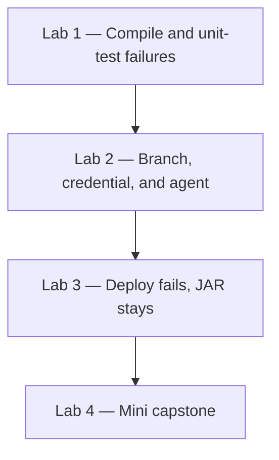

# Lab 06 — Operations, Troubleshooting, and Mini Capstone

**Day 5**  
**Duration:** 4 hours  
**Hands-on:** about 2.5–3 hours  
**Labs:** 4  
**Level:** Intermediate

Days 1–4 built one QuickCart pipeline. Today you break that pipeline on purpose, read the evidence Jenkins already recorded, and put it back. The last lab is the mini capstone: one successful delivery, one diagnosed failure, and one successful rerun.

## Business scenario

QuickCart will not adopt the pipeline until the team can answer a failed build without guessing. A red stage might be Java, a unit test, Git, a credential ID, a missing agent, or the deploy step. The JAR in Artifactory can still be good when only deployment failed.

You keep using `quickcart-order-ci`, the `quickcart-order-service` repository, and the Day 4 `Jenkinsfile`.



Start from a green pipeline. If Day 4 is not green, finish that lab before you introduce a new failure.

```text
Build ✓
Test ✓
Package ✓
Publish ✓
Retrieve ✓
Approval ✓
Deploy ✓
```

## Which version to follow

The Jenkins clicks are the same. Only the deploy-failure command follows the agent.

| Setup | Deploy failure in Lab 3 |
|---|---|
| Docker, including Docker Desktop on Windows | `sh` and `exit 1` |
| Windows service | `bat` and `exit /b 1` |

Git commands are the same in PowerShell and in bash. Do not print `ART_PASSWORD`.

---

# Lab 1 — Diagnose a Compile Failure and a Test Failure

## Business scenario

A developer says the latest pipeline failed and asks whether Jenkins is broken. You decide from the stage graph and Console Output before you change anything.

## Objectives

- Fail compilation and name the file Maven reports
- Fail the unit test and read the published test result
- Restore both and leave the pipeline green

### Estimated time
30–35 minutes

### Difficulty
Intermediate

---

## Exercise A — Compilation

### Step 1 — Confirm the baseline

Run `quickcart-order-ci` with **Build with Parameters**. Choose `dev` and select **Deploy** when approval appears. Build, Test, and Package must succeed before you continue.

### Step 2 — Remove the semicolon

In `src/main/java/com/quickcart/OrderCalculator.java`:

```java
return price * quantity
```

Commit and push:

```bash
git add .
git commit -m "Introduce compilation failure for troubleshooting lab"
git push
```

Let **Poll SCM** start the job, or select **Build with Parameters** if polling is off. Approve only if the run reaches the input. This failure stops at Build, so approval does not appear.

### Step 3 — Record the evidence before you fix it

```text
Build number:
Failed stage:
Pipeline result:
```

Open **Console Output**. The compiler names `OrderCalculator.java`. Maven exits non-zero. Jenkins marks Build failed and skips Test, Package, and Publish.

```text
Failed stage:              Build
Tool reporting failure:    Maven / Java compiler
Root cause:                Missing semicolon
Is Jenkins itself broken?  No
```

Jenkins ran Maven. Maven ran the compiler. The compiler rejected the source.

### Step 4 — Restore the line

```java
return price * quantity;
```

```bash
git add .
git commit -m "Fix compilation error"
git push
```

Run again and approve. Build succeeds.

---

## Exercise B — Unit test

### Step 5 — Change the expected total

In `src/test/java/com/quickcart/OrderCalculatorTest.java` change `200.0` to `300.0`:

```java
assertEquals(300.0, total);
```

The calculator still returns 200.

```bash
git add .
git commit -m "Introduce unit test failure"
git push
```

### Step 6 — Read the test result

```text
Build ✓
Test ✕
Package skipped
Publish skipped
```

Open **Test Result** on the failed build. The test `shouldCalculateOrderTotal` expected 300 and got 200. Console Output shows the same assertion. Package did not run, so this build did not publish a new JAR.

```text
Failed stage:     Test
Failed test:      shouldCalculateOrderTotal
Expected:         300
Actual:           200
Package ran?      No
```

### Step 7 — Restore the test

```java
assertEquals(200.0, total);
```

Commit, push, run, and approve. The pipeline is green again.

---

# Lab 2 — Troubleshoot the Branch, the Credential, and the Agent

## Business scenario

The Java is valid and the test passes. The next three failures are Jenkins configuration: the branch name, the credential ID, and the agent label.

## Objectives

- Cause each failure, name it from the log or the queue, and undo it
- Leave `*/main`, `artifactory-credentials`, and `agent any` in place

### Estimated time
35–40 minutes

### Difficulty
Intermediate

---

## Exercise A — Branch

Open `quickcart-order-ci` → **Configure**. Under **Pipeline → Branches to build**, replace `*/main` with:

```text
*/branch-does-not-exist
```

Save and select **Build Now**.

The build fails before any stage runs. Console Output says Jenkins could not find a revision to build. The repository is reachable. The branch name is not.

```text
Failure category:  SCM
Configured branch: */branch-does-not-exist
Branch exists?     No
```

Set **Branches to build** back to `*/main`, save, and run. Checkout succeeds.

## Exercise B — Credential ID

In the `Jenkinsfile`, change every:

```groovy
credentialsId: 'artifactory-credentials'
```

to:

```groovy
credentialsId: 'invalid-artifactory-credentials'
```

There are two `withCredentials` blocks, Publish and Retrieve. Change both so you do not fix one and leave the other broken.

```bash
git add Jenkinsfile
git commit -m "Introduce credential failure"
git push
```

Run the pipeline.

```text
Build ✓
Test ✓
Package ✓
Publish Artifact ✕
```

The log says Jenkins could not find the credentials entry. It does not mean the Artifactory password is wrong. The ID is not in the store. Do not print the password to compare it.

Confirm **Manage Jenkins → Credentials** still has `artifactory-credentials` and does not have `invalid-artifactory-credentials`.

Put `artifactory-credentials` back in both blocks, commit, push, and run. Publish succeeds.

## Exercise C — Agent label

Change:

```groovy
agent any
```

to:

```groovy
agent {
    label 'quickcart-agent-does-not-exist'
}
```

Commit, push, and start the build. It stays in the queue. The message says it is waiting for an agent with that label. **Manage Jenkins → Nodes** shows the built-in node, and that node does not have the label. No executor is busy. Nothing is wrong with the Java.

Abort the queued build so the controller is free for the next exercise. Restore `agent any`, commit, push, and run until the pipeline can start.

## Lab 2 matrix

| What you see | Look here |
|---|---|
| Couldn’t find any revision to build | **Branches to build** |
| Could not find credentials entry | Credential ID in the `Jenkinsfile` and in the store |
| Waiting for next available executor, with a label | **Nodes** and `agent` |
| Java compiler error | `OrderCalculator.java` |
| Test Result shows a failure | `OrderCalculatorTest.java` |
| `401` from Artifactory | Username or password, after the ID is found |
| JAR path does not exist | `target/` and the `mvn package` stage |

---

# Lab 3 — A Failed Deploy Keeps the JAR

## Business scenario

Build 105 passed build, test, package, publish, and approval. UAT deployment then failed. The question is whether to compile again.

## Objectives

- Fail only the Deploy stage
- Show that the JAR is still in Artifactory
- Remove the failure and deploy without changing the Java

### Estimated time
25–30 minutes

### Difficulty
Intermediate

---

## Step 1 — Break Deploy

Replace the Deploy stage with the version for your agent. Leave the earlier stages as they are.

### Docker setup

```groovy
stage('Deploy') {

    steps {

        echo "Deploying ${APP_NAME}"
        echo "Environment: ${params.DEPLOY_ENVIRONMENT}"

        sh '''
            echo "Simulating deployment failure"
            exit 1
        '''
    }
}
```

### Windows service setup

```groovy
stage('Deploy') {

    steps {

        echo "Deploying ${APP_NAME}"
        echo "Environment: ${params.DEPLOY_ENVIRONMENT}"

        bat '''
            echo Simulating deployment failure
            exit /b 1
        '''
    }
}
```

```bash
git add Jenkinsfile
git commit -m "Simulate deployment failure"
git push
```

## Step 2 — Approve, then read the failure

Run with `DEPLOY_ENVIRONMENT` = `uat`. Select **Deploy** at the approval. The stages through approval succeed. Deploy fails.

```text
Build ✓
Test ✓
Package ✓
Publish ✓
Retrieve ✓
Approval ✓
Deploy ✕
```

Console Output contains `Simulating deployment failure`. The Java compiler did not run in that stage.

## Step 3 — Decide what to rebuild

Do not change `OrderCalculator.java`. The tested JAR for this build number is already in Artifactory. Deployment failed after that publish. Recompiling would create a different build number and would not explain the `exit 1`.

Open Artifactory and find `quickcart-order-service-1.0.0-<this build>.jar`. It is still there.

If this had been a bad release and an older build such as 104 had deployed cleanly, rollback means download 104 and approve that file. Fix-forward means correct the deploy step and run again. This lab is fix-forward.

## Step 4 — Restore Deploy

Remove the `sh` or `bat` block. Return Deploy to the echo-only stage from [Lab 05](Lab%2005%20-%20Credentials%20Artifactory%20and%20Deployment.md). Commit, push, run, and approve.

```text
Deploy ✓
```

---

# Lab 4 — Mini Capstone

## Business scenario

QuickCart will adopt Jenkins for the Order Service only if you can show one complete delivery and one recovery. Use the pipeline you already have. Do not start a second application.

## Objectives

- Prove the Day 4 pipeline is green
- Break one thing
- Diagnose it from Jenkins before you change it
- Rerun to success and keep both builds as evidence

### Estimated time
70–90 minutes

### Difficulty
Intermediate

---

## Part 1 — Confirm the pieces

| Check | Where |
|---|---|
| `pom.xml`, `Jenkinsfile`, `src/`, `.gitignore` | Git repository on `main`. `target/` is not committed |
| Definition **Pipeline script from SCM**, branch `*/main`, script path `Jenkinsfile` | `quickcart-order-ci` |
| ID `artifactory-credentials`, password not visible | **Manage Jenkins → Credentials** |
| `tools { maven 'Maven-3.9' }` and the agent commands for your setup | `Jenkinsfile` from Lab 05 |

The file must publish, download, wait for `input`, and simulate deploy. Docker uses `sh` and `curl`. The Windows service uses `bat` and `curl.exe`.

## Part 2 — Run it green

**Build with Parameters**, environment `uat`, then **Deploy**.

```text
Build ✓
Test ✓
Package ✓
Publish ✓
Retrieve ✓
Approval ✓
Deploy ✓
```

Open **Test Result** and the Artifactory path for this build number. This build is the baseline.

## Part 3 — Break one thing

Pick one. Do not stack several failures.

| Option | Change |
|---|---|
| A — Unit test | `assertEquals(300.0, total);` |
| B — Compile | Remove the semicolon in `calculateTotal` |
| C — Credential | `credentialsId: 'invalid-artifactory-credentials'` in both blocks |
| D — Artifact path | Change `target/*.jar` or the `curl` upload path so the JAR cannot be found |
| E — Branch | **Branches to build** = `*/branch-does-not-exist` |

Push when the change is in Git. For option E, save the job and run it. Do not fix it yet.

## Part 4 — Write the record from the failed build

```text
Jenkins job:
Build number:
Build result:
Last successful stage:
Failed stage:
First meaningful error:
Tool or component:
Root cause:
Proposed fix:
```

## Part 5 — Fix and rerun

Restore the working Day 4 pipeline. Commit and push, or correct the branch in the job. Run again, approve, and finish SUCCESS.

Build History should show the green baseline, the failure, and the fixed run. The numbers will not match this example. The order will:

```text
#108 SUCCESS
#107 FAILURE
#106 SUCCESS
```

Those three builds are the pipeline evidence.

## Deliverables

| # | Deliverable | Done |
|---:|---|---|
| 1 | Working `Jenkinsfile` | ☐ |
| 2 | Successful pipeline | ☐ |
| 3 | Automated build | ☐ |
| 4 | Unit tests | ☐ |
| 5 | Test results on the build | ☐ |
| 6 | JAR in Artifactory | ☐ |
| 7 | Approval | ☐ |
| 8 | Simulated deployment | ☐ |
| 9 | One deliberate failure | ☐ |
| 10 | Diagnosis written before the fix | ☐ |
| 11 | Correction | ☐ |
| 12 | Successful rerun | ☐ |
| 13 | Failed and successful builds kept in history | ☐ |

---

# Final scenario

Use this only after Lab 4. A developer pushed a change. Jenkins started. Compilation finished. The release did not reach UAT.

From the build log, name the last successful stage, the failed stage, and whether the cause is SCM, build, test, credential, artifact, agent, or deployment. Fix it, rerun, approve, and show the failed build next to the successful one.

---

# Troubleshooting reference

| Symptom | Look at | Likely cause |
|---|---|---|
| Compiler error | Console Output, Build stage | Source |
| Test Result is red | Test stage | Assertion |
| No revision to build | Branch specifier | `*/main` was changed |
| Credentials entry not found | Credential ID | Typo, or the store is missing the ID |
| `401` from Artifactory | Username and password | The ID exists, the secret does not match |
| Waiting for an executor | Nodes and `agent` | Label or zero executors |
| JAR not found | Package stage and `target/` | Upload path |
| Approval waiting | Build page input | Nobody has selected **Deploy** or **Abort** |
| Deploy red, earlier stages green | Deploy stage only | The JAR can stay; fix the deploy step |

---

# Day 5 checklist

| Lab | Outcome |
|---|---|
| 1 | Compile and test failures are named from the log and the test report, then fixed |
| 2 | Branch, credential ID, and agent label are diagnosed and restored |
| 3 | Deploy fails after a good publish, and the JAR remains in Artifactory |
| 4 | One green delivery, one recorded failure, and one green rerun |

The standalone ShopSphere project is [Lab 08 — Capstone 2](Lab%2008%20-%20Capstone%202%20ShopSphere%20Order%20Service.md). It is not required to finish this QuickCart capstone.
