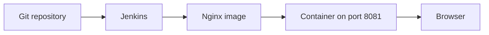

# Lab 07 — Capstone 1: Deploy a Web App on Docker

**Type:** Standalone capstone  
**Duration:** 2–3 hours  
**Level:** Intermediate

This capstone does not use the QuickCart Order Service, Maven, or Artifactory. You can start it after Jenkins and Docker are running. Every file and every Jenkins click is in this lab.

## Business scenario

QuickCart Marketing needs a campaign page online the same day the copy changes. Today someone builds an image by hand and restarts a container. The team wants one pipeline:

```text
Git push
  ↓
Jenkins checks out the site
  ↓
Docker builds an Nginx image
  ↓
The previous container is replaced
  ↓
The new page answers on port 8081
```

You are the engineer who delivers that pipeline for the campaign site `quickcart-campaign`.



## What you will have at the end

- A Git repository with `Dockerfile`, `site/index.html`, and `Jenkinsfile`
- Job `quickcart-campaign` that builds from `main`
- Container `quickcart-campaign` serving the page at `http://localhost:8081`
- A second build that replaces the container after you change the page

## Prerequisites

| Requirement | What you need |
|---|---|
| Docker | `docker version` succeeds on the machine that will run the container |
| Jenkins | A controller from Lab 01, or an instructor URL. The built-in node needs at least one executor |
| Git | On the computer where you create the files |
| Repository | An empty Git remote you can push to, or one the instructor provides |
| Port 8081 | Free on the Docker host. Jenkins itself should stay on 8080 |

This capstone runs `docker` on the Jenkins agent. Installing Docker on your laptop is not enough if the agent cannot see that Docker engine.

### Give the agent a Docker engine

Use one path.

**Jenkins is not in a container** and `docker version` works in that same operating system. A Linux host, a Mac with Docker Desktop, or a Windows Jenkins service whose account can run `docker` fits here. The Windows service often runs as Local System, and Local System cannot see Docker Desktop. If `docker version` fails in an elevated Command Prompt, use the container path below or run the Jenkins service as the Windows user who starts Docker Desktop.

**Jenkins is the Lab 01 Docker container.** Recreate it so the container can talk to the host engine. Stop the old container first. Keep the volume `jenkins_home`.

Linux or Docker Desktop with the WSL2 engine:

```powershell
docker stop jenkins
docker rm jenkins
docker run -d --name jenkins -p 8080:8080 -p 50000:50000 -v jenkins_home:/var/jenkins_home -v /var/run/docker.sock:/var/run/docker.sock jenkins/jenkins:lts
```

Then install the Docker client inside that container. The socket mount gives the client the host engine. It also gives the container control of that engine, so use this on a training machine.

```powershell
docker exec -u root jenkins bash -c "apt-get update && apt-get install -y docker.io curl"
```

On Docker Desktop for Windows, `docker.sock` is not a reliable mount from the Windows engine into this Linux image. Run this capstone with Jenkins in WSL2, or with Jenkins on a host where `docker version` already works.

Confirm from the agent, after the first pipeline, that `docker version` prints a server version. A client without a server cannot build.

### Which Jenkinsfile to use

| Agent | Jenkinsfile |
|---|---|
| Linux, including Jenkins in the Docker image above | **Docker setup** — `sh` |
| Windows service that can run `docker` | **Windows service setup** — `bat` |

---

# Part 1 — Create the site

## Step 1 — Create the folder

On your computer:

**Windows PowerShell**

```powershell
mkdir quickcart-campaign
cd quickcart-campaign
mkdir site
New-Item -ItemType File -Name Dockerfile
New-Item -ItemType File -Name Jenkinsfile
New-Item -ItemType File -Path site\index.html
```

**macOS or Linux**

```bash
mkdir -p quickcart-campaign/site
cd quickcart-campaign
touch Dockerfile Jenkinsfile site/index.html
```

```text
quickcart-campaign/
├── Dockerfile
├── Jenkinsfile
└── site/
    └── index.html
```

## Step 2 — Write the page

`site/index.html`

```html
<!doctype html>
<html lang="en">
<head>
  <meta charset="utf-8" />
  <title>QuickCart Campaign</title>
  <meta name="viewport" content="width=device-width, initial-scale=1" />
  <style>
    body { font-family: system-ui, Arial; margin: 3rem; }
    .card { border: 1px solid #ddd; padding: 1.5rem; border-radius: 12px; }
    h1 { margin-top: 0; }
    .ok { color: #0a0; font-weight: 700; }
  </style>
</head>
<body>
  <div class="card">
    <h1>QuickCart campaign</h1>
    <p class="ok">This page is running in Nginx, deployed by Jenkins.</p>
    <p>Build 1</p>
  </div>
</body>
</html>
```

## Step 3 — Write the Dockerfile

```dockerfile
FROM nginx:alpine

RUN rm -rf /usr/share/nginx/html/*
COPY site/ /usr/share/nginx/html/

EXPOSE 80
```

The image serves whatever is in `site/`. Nginx already starts when the container starts.

## Step 4 — Commit and push

`Jenkinsfile` can be empty for this commit. Part 2 fills it before the first Jenkins build. Or write it first, then commit once.

```bash
git init
git add .
git commit -m "Add QuickCart campaign site"
git branch -M main
git remote add origin <repository-url>
git push -u origin main
```

If Git has no name or email:

```bash
git config user.name "Your Name"
git config user.email "you@example.com"
```

Set those for this repository only, then commit again. The branch must be `main`.

---

# Part 2 — Write the pipeline

The pipeline checks out `main`, builds `local/quickcart-campaign:<build number>`, removes any container already named `quickcart-campaign`, starts the new one on host port **8081**, and asks that container whether Nginx answers.

Save one of these as `Jenkinsfile`. Do not save `Jenkinsfile.txt`.

## Docker setup

```groovy
pipeline {

    agent any

    environment {
        APP_NAME = 'quickcart-campaign'
        HOST_PORT = '8081'
        CONTAINER_NAME = 'quickcart-campaign'
    }

    options {
        timestamps()
    }

    stages {

        stage('Checkout') {
            steps {
                checkout scm
            }
        }

        stage('Build Docker Image') {
            steps {
                sh '''
                    docker build -t "local/${APP_NAME}:${BUILD_NUMBER}" .
                '''
            }
        }

        stage('Replace Container') {
            steps {
                sh '''
                    docker rm -f "${CONTAINER_NAME}" || true
                    docker run -d --name "${CONTAINER_NAME}" \
                      -p "${HOST_PORT}:80" \
                      "local/${APP_NAME}:${BUILD_NUMBER}"
                '''
            }
        }

        stage('Health Check') {
            steps {
                sh '''
                    ok=0
                    for i in 1 2 3 4 5 6 7 8 9 10; do
                      if docker exec "${CONTAINER_NAME}" wget -q -O /dev/null http://127.0.0.1/; then
                        ok=1
                        break
                      fi
                      sleep 2
                    done
                    if [ "$ok" != "1" ]; then
                      echo "Health check failed"
                      docker logs "${CONTAINER_NAME}" || true
                      exit 1
                    fi
                '''
            }
        }
    }

    post {
        success {
            echo "Deployed: http://localhost:${HOST_PORT}"
        }
        always {
            sh '''
                docker ps --filter "name=${CONTAINER_NAME}" --format "table {{.Names}}\t{{.Image}}\t{{.Ports}}" || true
            '''
        }
    }
}
```

## Windows service setup

Use this only when the Jenkins service account can run `docker`.

```groovy
pipeline {

    agent any

    environment {
        APP_NAME = 'quickcart-campaign'
        HOST_PORT = '8081'
        CONTAINER_NAME = 'quickcart-campaign'
    }

    options {
        timestamps()
    }

    stages {

        stage('Checkout') {
            steps {
                checkout scm
            }
        }

        stage('Build Docker Image') {
            steps {
                bat '''
                    docker build -t local/%APP_NAME%:%BUILD_NUMBER% .
                '''
            }
        }

        stage('Replace Container') {
            steps {
                bat '''
                    docker rm -f %CONTAINER_NAME%
                    docker run -d --name %CONTAINER_NAME% -p %HOST_PORT%:80 local/%APP_NAME%:%BUILD_NUMBER%
                '''
            }
        }

        stage('Health Check') {
            steps {
                bat '''
                    docker exec %CONTAINER_NAME% wget -q -O NUL http://127.0.0.1/
                '''
            }
        }
    }

    post {
        success {
            echo "Deployed: http://localhost:${HOST_PORT}"
        }
        always {
            bat '''
                docker ps --filter "name=%CONTAINER_NAME%"
            '''
        }
    }
}
```

`docker rm -f` on Windows returns an error when the container is absent. The first build can ignore that line’s failure if you delete the `docker rm` line until a container exists, or run once so the image build is proven and then keep `docker rm`. If the first Windows build stops on `docker rm`, remove that one line, run a successful build, then put `docker rm -f %CONTAINER_NAME%` back for the next deploy.

The health check runs inside the Nginx container. It does not call port 8081 from inside the Jenkins container, which would miss a port published on the host.

Push the file:

```bash
git add Jenkinsfile
git commit -m "Add campaign deployment pipeline"
git push
```

---

# Part 3 — Create the Jenkins job

## Step 1 — New pipeline

Select **New Item**. Name it `quickcart-campaign`. Select **Pipeline**, then **OK**.

## Step 2 — Point it at Git

| Field | Value |
|---|---|
| Definition | **Pipeline script from SCM** |
| SCM | **Git** |
| Repository URL | The URL you pushed |
| Credentials | **None** for a public repository. For a private repository, select a **Username with password** or SSH credential from **Manage Jenkins → Credentials → System → Global credentials**. Do not put the password in the Jenkinsfile |
| Branches to build | `*/main` |
| Script Path | `Jenkinsfile` |

Change `*/master` if Jenkins filled that in. Select **Save**.

## Step 3 — Run the first build

Select **Build Now**.

Console Output should show a Git checkout, a Docker build, a new container, and `Finished: SUCCESS`.

On the Docker host, open [http://localhost:8081](http://localhost:8081). The page says **QuickCart campaign** and **Build 1**.

If Jenkins is on another machine, open port 8081 on the Docker host, not on your laptop, unless they are the same computer.

Confirm the container:

```powershell
docker ps --filter "name=quickcart-campaign"
```

You should see `quickcart-campaign` and `0.0.0.0:8081->80/tcp`.

---

# Part 4 — Change the page and redeploy

## Step 1 — Edit the copy

In `site/index.html`, change `Build 1` to `Build 2`.

```bash
git add site/index.html
git commit -m "Update campaign copy"
git push
```

## Step 2 — Build again

Select **Build Now**. Do not start a second container by hand.

Refresh [http://localhost:8081](http://localhost:8081). The page shows **Build 2**. The container name is still `quickcart-campaign`. The image tag is the new build number.

## Step 3 — Optional: start the job from a push

A Jenkins URL on your own computer cannot receive a GitHub webhook. Use polling.

1. **Configure** the job.
2. Select **Build Triggers → Poll SCM**.
3. Schedule: `H/2 * * * *`
4. Save.

The next push starts a build within about two minutes. Do not also click **Build Now** if you are checking the trigger.

If the instructor’s Jenkins is reachable from GitHub, you can use a webhook instead. Install the **GitHub** plugin, enable **GitHub hook trigger for GITScm polling**, and set the payload URL to `http://<jenkins-host>/github-webhook/` with content type `application/json` and the push event.

---

# Optional — Push the image to Docker Hub

Skip this if the capstone only needs the local container.

1. **Manage Jenkins → Credentials → System → Global credentials → Add Credentials**.
2. Kind **Username with password**. ID `dockerhub`. Username and password are the Docker Hub account. Use an access token as the password.
3. Add this stage after **Build Docker Image**. It does not print the token.

**Docker setup**

```groovy
stage('Push to Docker Hub') {
    steps {
        withCredentials([
            usernamePassword(
                credentialsId: 'dockerhub',
                usernameVariable: 'DOCKERHUB_USER',
                passwordVariable: 'DOCKERHUB_PASS'
            )
        ]) {
            sh '''
                echo "$DOCKERHUB_PASS" | docker login -u "$DOCKERHUB_USER" --password-stdin
                docker tag "local/${APP_NAME}:${BUILD_NUMBER}" "${DOCKERHUB_USER}/${APP_NAME}:${BUILD_NUMBER}"
                docker push "${DOCKERHUB_USER}/${APP_NAME}:${BUILD_NUMBER}"
            '''
        }
    }
}
```

**Windows service setup**

```groovy
stage('Push to Docker Hub') {
    steps {
        withCredentials([
            usernamePassword(
                credentialsId: 'dockerhub',
                usernameVariable: 'DOCKERHUB_USER',
                passwordVariable: 'DOCKERHUB_PASS'
            )
        ]) {
            bat '''
                echo %DOCKERHUB_PASS% | docker login -u %DOCKERHUB_USER% --password-stdin
                docker tag local/%APP_NAME%:%BUILD_NUMBER% %DOCKERHUB_USER%/%APP_NAME%:%BUILD_NUMBER%
                docker push %DOCKERHUB_USER%/%APP_NAME%:%BUILD_NUMBER%
            '''
        }
    }
}
```

---

# Clean up

On the Docker host:

```powershell
docker rm -f quickcart-campaign
```

Remove one image by the tag you built, for example:

```powershell
docker image rm local/quickcart-campaign:1
```

---

# If something fails

| What you see | What to change |
|---|---|
| Couldn’t find any revision to build | **Branches to build** is `*/main` |
| `Jenkinsfile` not found | The file is at the repository root and is not named `Jenkinsfile.txt` |
| `docker: not found` or cannot connect to the daemon | The agent cannot see a Docker engine. Repeat **Give the agent a Docker engine** |
| `Cannot run program "sh"` | You are on the Windows service. Use the Windows Jenkinsfile |
| `'bat' is not recognized` or no `bat` | You are in the Linux container. Use the Docker Jenkinsfile |
| Port 8081 is allocated | Set `HOST_PORT` to `8082`, push, and open that port. Jenkins on 8080 is not this site |
| Health check failed | `docker logs quickcart-campaign`. The page files must be copied to `/usr/share/nginx/html` |
| Browser does not show the new text | Hard refresh. Confirm `docker ps` shows the new image tag |
| First Windows build fails on `docker rm` | No container exists yet. See the note under the Windows Jenkinsfile |

---

# Capstone checklist

| # | Done |
|---:|---|
| 1 | Repository on `main` contains `Dockerfile`, `site/index.html`, and `Jenkinsfile` |
| 2 | Job `quickcart-campaign` uses **Pipeline script from SCM** and `*/main` |
| 3 | Build **SUCCESS** and the image is `local/quickcart-campaign:<build number>` |
| 4 | `docker ps` shows `quickcart-campaign` on port 8081 |
| 5 | The browser shows the campaign page |
| 6 | A content change, pushed and rebuilt, replaces the page |
| 7 | The password for a private Git remote or Docker Hub is a Jenkins credential, not text in the `Jenkinsfile` |
