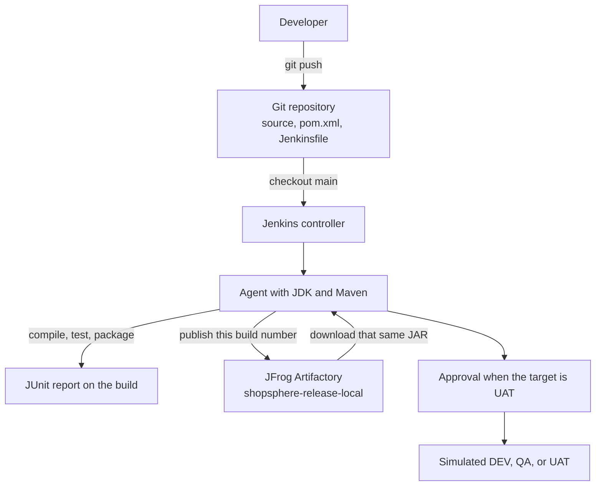
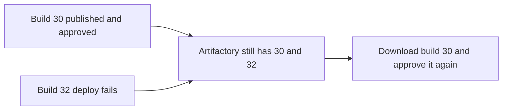

# Lab 08 — Capstone 2: ShopSphere Order Service

**Type:** Standalone capstone  
**Duration:** 3–4 hours  
**Mode:** Individual, or teams of 2–3  
**Level:** Intermediate

This project does not continue the QuickCart repository. ShopSphere is a new company, a new repository, and a new Jenkins job. Jenkins itself may already be the controller from Lab 01.

## Business scenario

ShopSphere’s Order Management Service calculates an order total, a discount, and the amount due. Releases are still manual: a developer builds on a laptop, sometimes skips tests, copies a JAR, and asks operations to deploy it.

That produces builds that differ between machines, JARs nobody can trace, passwords in chat, and no previous JAR ready when a release must be undone.

You are the DevOps engineer assigned to replace that path.

## Architecture



One build produces one JAR. DEV, QA, and UAT download that file. They do not compile again. UAT waits for a person. A failed deploy does not delete the JAR. An older build number in Artifactory is the rollback.



## What you must deliver

| Area | Requirement |
|---|---|
| Application | Maven project `shopsphere-order-service` version `1.0.0` |
| Tests | Three JUnit tests, published on the Jenkins build |
| Pipeline | Declarative `Jenkinsfile` in Git |
| Configuration | `APP_NAME`, `APP_VERSION`, and parameters `DEPLOY_ENVIRONMENT`, `RUN_TESTS` |
| Resilience | Build timeout. Publish retries up to three times |
| Security | Credential ID `shopsphere-artifactory`. No password in Git |
| Artifact | JAR in Artifactory, name includes the Jenkins build number |
| Delivery | Download that JAR, approve UAT, print a simulated deploy |
| Operations | `post` for success, failure, and aborted |
| Evidence | One green run, one diagnosed failure, one green rerun, and a rollback explanation |

## Prerequisites

| Requirement | What you need |
|---|---|
| Jenkins | A controller with at least one executor on the built-in node |
| JDK 21 | On your computer. It compiles the Java 17 source in this project |
| Maven 3.9 | On your computer, for the local test. `mvn -version` |
| Git | A new empty remote. Do not push this into the QuickCart repository |
| Artifactory | URL, repository, username, and password or token from the instructor |
| `curl` | On the Jenkins agent |

Examples used below. Replace them when the instructor gives different values.

```text
Jenkins job:        shopsphere-order-ci
Credential ID:      shopsphere-artifactory
Repository:         shopsphere-release-local
Artifactory URL:    http://<artifactory-host>:8081/artifactory
```

Do not point that URL at Jenkins. Jenkins is usually port 8080.

### Maven and curl on the agent

Your laptop Maven is not visible inside the Jenkins Docker image, and the Windows service often cannot see your user `Path`.

1. **Manage Jenkins → Tools → Maven → Add Maven**.
2. Name it `Maven-3.9`. Select **Install automatically** and a 3.9 version. Save.

The Jenkinsfile uses `tools { maven 'Maven-3.9' }`.

If the agent is the Jenkins container and `curl` is missing:

```powershell
docker exec -u root jenkins bash -c "apt-get update && apt-get install -y curl"
```

### Which commands to use

| Agent | Maven, folders, and curl |
|---|---|
| Docker, including Docker Desktop on Windows | `sh` and `curl`. Variables are `$NAME` |
| Windows service | `bat` and `curl.exe`. Variables are `%NAME%` |

The approval, parameters, and `echo` stages are the same.

---

# Part 1 — Create the application

## Step 1 — Create the tree

**Windows PowerShell**

```powershell
mkdir shopsphere-order-service\src\main\java\com\shopsphere\order -Force
mkdir shopsphere-order-service\src\test\java\com\shopsphere\order -Force
cd shopsphere-order-service
```

**macOS or Linux**

```bash
mkdir -p shopsphere-order-service/src/main/java/com/shopsphere/order
mkdir -p shopsphere-order-service/src/test/java/com/shopsphere/order
cd shopsphere-order-service
```

## Step 2 — `pom.xml`

JDK 21 compiles this `source` and `target` of 17.

```xml
<project xmlns="http://maven.apache.org/POM/4.0.0"
         xmlns:xsi="http://www.w3.org/2001/XMLSchema-instance"
         xsi:schemaLocation="http://maven.apache.org/POM/4.0.0
         https://maven.apache.org/xsd/maven-4.0.0.xsd">

    <modelVersion>4.0.0</modelVersion>

    <groupId>com.shopsphere</groupId>
    <artifactId>shopsphere-order-service</artifactId>
    <version>1.0.0</version>

    <properties>
        <maven.compiler.source>17</maven.compiler.source>
        <maven.compiler.target>17</maven.compiler.target>
        <project.build.sourceEncoding>UTF-8</project.build.sourceEncoding>
        <junit.version>5.10.2</junit.version>
    </properties>

    <dependencies>
        <dependency>
            <groupId>org.junit.jupiter</groupId>
            <artifactId>junit-jupiter</artifactId>
            <version>${junit.version}</version>
            <scope>test</scope>
        </dependency>
    </dependencies>

    <build>
        <plugins>
            <plugin>
                <groupId>org.apache.maven.plugins</groupId>
                <artifactId>maven-surefire-plugin</artifactId>
                <version>3.2.5</version>
            </plugin>
        </plugins>
    </build>

</project>
```

## Step 3 — Order service

`src/main/java/com/shopsphere/order/OrderService.java`

```java
package com.shopsphere.order;

public class OrderService {

    public double calculateOrderTotal(double unitPrice, int quantity) {

        if (unitPrice < 0) {
            throw new IllegalArgumentException("Unit price cannot be negative");
        }

        if (quantity <= 0) {
            throw new IllegalArgumentException("Quantity must be greater than zero");
        }

        return unitPrice * quantity;
    }

    public double calculateDiscount(double orderTotal, double discountPercentage) {

        if (discountPercentage < 0 || discountPercentage > 100) {
            throw new IllegalArgumentException("Invalid discount percentage");
        }

        return orderTotal * discountPercentage / 100;
    }

    public double calculateFinalAmount(double orderTotal, double discount) {
        return orderTotal - discount;
    }
}
```

## Step 4 — Tests

`src/test/java/com/shopsphere/order/OrderServiceTest.java`

```java
package com.shopsphere.order;

import org.junit.jupiter.api.Test;

import static org.junit.jupiter.api.Assertions.assertEquals;

class OrderServiceTest {

    @Test
    void shouldCalculateOrderTotal() {
        OrderService service = new OrderService();
        double total = service.calculateOrderTotal(500, 2);
        assertEquals(1000, total);
    }

    @Test
    void shouldCalculateDiscount() {
        OrderService service = new OrderService();
        double discount = service.calculateDiscount(1000, 10);
        assertEquals(100, discount);
    }

    @Test
    void shouldCalculateFinalAmount() {
        OrderService service = new OrderService();
        double amount = service.calculateFinalAmount(1000, 100);
        assertEquals(900, amount);
    }
}
```

## Step 5 — Prove it on your computer

```bash
mvn clean compile
mvn test
mvn package
```

`mvn test` reports `Tests run: 3`, `Failures: 0`. The JAR is `target/shopsphere-order-service-1.0.0.jar`.

## Step 6 — Push `main`

`.gitignore`

```text
target/
.idea/
.vscode/
*.iml
```

```bash
git init
git add .
git commit -m "Initial ShopSphere Order Service"
git branch -M main
git remote add origin <repository-url>
git push -u origin main
```

If the commit is rejected for a missing identity, set `user.name` and `user.email` for this repository only and commit again. `target/` must not appear on the remote.

---

# Part 2 — Store the Artifactory credential

**Manage Jenkins → Credentials → System → Global credentials (unrestricted) → Add Credentials**.

| Field | Value |
|---|---|
| Kind | **Username with password** |
| Scope | **Global** |
| Username | Instructor’s Artifactory user |
| Password | Instructor’s password or token |
| ID | `shopsphere-artifactory` |
| Description | `ShopSphere Artifactory Credentials` |

The password must not appear in the `Jenkinsfile`.

---

# Part 3 — Write the Jenkinsfile

Create `Jenkinsfile` with no file extension. Use one agent version. Keep `tools`, the credential ID, and the UAT approval in both.

`when { params.DEPLOY_ENVIRONMENT == 'uat' }` means DEV and QA do not wait. The demonstration run in Part 5 uses **uat** so the gate is visible.

## Docker setup

```groovy
pipeline {

    agent any

    tools {
        maven 'Maven-3.9'
    }

    parameters {

        choice(
            name: 'DEPLOY_ENVIRONMENT',
            choices: ['dev', 'qa', 'uat'],
            description: 'Target deployment environment'
        )

        booleanParam(
            name: 'RUN_TESTS',
            defaultValue: true,
            description: 'Run unit tests'
        )
    }

    environment {
        APP_NAME = 'shopsphere-order-service'
        APP_VERSION = '1.0.0'
        ARTIFACTORY_URL = 'http://<artifactory-host>:8081/artifactory'
        ARTIFACTORY_REPO = 'shopsphere-release-local'
    }

    stages {

        stage('Initialize') {
            steps {
                echo 'ShopSphere CI/CD Pipeline'
                echo "Application: ${APP_NAME}"
                echo "Version: ${APP_VERSION}"
                echo "Build: ${env.BUILD_NUMBER}"
                echo "Environment: ${params.DEPLOY_ENVIRONMENT}"
            }
        }

        stage('Build') {
            steps {
                timeout(time: 2, unit: 'MINUTES') {
                    echo 'Compiling ShopSphere Order Service'
                    sh 'mvn clean compile'
                }
            }
        }

        stage('Unit Test') {
            when {
                expression { return params.RUN_TESTS }
            }
            steps {
                echo 'Running automated unit tests'
                sh 'mvn test'
            }
        }

        stage('Package') {
            steps {
                echo 'Creating deployment artifact'
                sh 'mvn package -DskipTests'
            }
        }

        stage('Publish Artifact') {
            steps {
                withCredentials([
                    usernamePassword(
                        credentialsId: 'shopsphere-artifactory',
                        usernameVariable: 'ART_USER',
                        passwordVariable: 'ART_PASSWORD'
                    )
                ]) {
                    retry(3) {
                        sh '''
                            curl --fail \
                            -u "$ART_USER:$ART_PASSWORD" \
                            -T "target/${APP_NAME}-${APP_VERSION}.jar" \
                            "${ARTIFACTORY_URL}/${ARTIFACTORY_REPO}/${APP_NAME}/${APP_VERSION}/${APP_NAME}-${APP_VERSION}-${BUILD_NUMBER}.jar"
                        '''
                    }
                }
            }
        }

        stage('Prepare Deployment') {
            steps {
                sh '''
                    rm -rf deployment
                    mkdir -p deployment
                '''
            }
        }

        stage('Retrieve Artifact') {
            steps {
                withCredentials([
                    usernamePassword(
                        credentialsId: 'shopsphere-artifactory',
                        usernameVariable: 'ART_USER',
                        passwordVariable: 'ART_PASSWORD'
                    )
                ]) {
                    sh '''
                        curl --fail \
                        -u "$ART_USER:$ART_PASSWORD" \
                        -o "deployment/${APP_NAME}-${APP_VERSION}-${BUILD_NUMBER}.jar" \
                        "${ARTIFACTORY_URL}/${ARTIFACTORY_REPO}/${APP_NAME}/${APP_VERSION}/${APP_NAME}-${APP_VERSION}-${BUILD_NUMBER}.jar"
                    '''
                }
            }
        }

        stage('Deployment Approval') {
            when {
                expression { return params.DEPLOY_ENVIRONMENT == 'uat' }
            }
            steps {
                input(
                    message: "Deploy ShopSphere Build ${env.BUILD_NUMBER} to UAT?",
                    ok: 'Approve Deployment'
                )
            }
        }

        stage('Deploy') {
            steps {
                echo 'Deploying ShopSphere'
                echo "Application: ${APP_NAME}"
                echo "Version: ${APP_VERSION}"
                echo "Build: ${env.BUILD_NUMBER}"
                echo "Target: ${params.DEPLOY_ENVIRONMENT}"
                echo 'Artifact source: Artifactory'
                echo 'Deployment completed'
            }
        }
    }

    post {
        always {
            junit(
                allowEmptyResults: true,
                testResults: 'target/surefire-reports/*.xml'
            )
        }
        success {
            archiveArtifacts(
                artifacts: 'target/*.jar',
                fingerprint: true
            )
            echo 'ShopSphere Pipeline SUCCESS'
        }
        failure {
            echo 'ShopSphere Pipeline FAILED'
        }
        aborted {
            echo 'ShopSphere Pipeline ABORTED'
        }
    }
}
```

## Windows service setup

Use this file when the agent is the Windows service. `timeout`, `retry`, `withCredentials`, `input`, `junit`, and `archiveArtifacts` match the Docker file. Do not echo `ART_PASSWORD`.

```groovy
pipeline {

    agent any

    tools {
        maven 'Maven-3.9'
    }

    parameters {

        choice(
            name: 'DEPLOY_ENVIRONMENT',
            choices: ['dev', 'qa', 'uat'],
            description: 'Target deployment environment'
        )

        booleanParam(
            name: 'RUN_TESTS',
            defaultValue: true,
            description: 'Run unit tests'
        )
    }

    environment {
        APP_NAME = 'shopsphere-order-service'
        APP_VERSION = '1.0.0'
        ARTIFACTORY_URL = 'http://<artifactory-host>:8081/artifactory'
        ARTIFACTORY_REPO = 'shopsphere-release-local'
    }

    stages {

        stage('Initialize') {
            steps {
                echo 'ShopSphere CI/CD Pipeline'
                echo "Application: ${APP_NAME}"
                echo "Version: ${APP_VERSION}"
                echo "Build: ${env.BUILD_NUMBER}"
                echo "Environment: ${params.DEPLOY_ENVIRONMENT}"
            }
        }

        stage('Build') {
            steps {
                timeout(time: 2, unit: 'MINUTES') {
                    echo 'Compiling ShopSphere Order Service'
                    bat 'mvn clean compile'
                }
            }
        }

        stage('Unit Test') {
            when {
                expression { return params.RUN_TESTS }
            }
            steps {
                echo 'Running automated unit tests'
                bat 'mvn test'
            }
        }

        stage('Package') {
            steps {
                echo 'Creating deployment artifact'
                bat 'mvn package -DskipTests'
            }
        }

        stage('Publish Artifact') {
            steps {
                withCredentials([
                    usernamePassword(
                        credentialsId: 'shopsphere-artifactory',
                        usernameVariable: 'ART_USER',
                        passwordVariable: 'ART_PASSWORD'
                    )
                ]) {
                    retry(3) {
                        bat '''
                            curl.exe --fail -u "%ART_USER%:%ART_PASSWORD%" -T "target\\%APP_NAME%-%APP_VERSION%.jar" "%ARTIFACTORY_URL%/%ARTIFACTORY_REPO%/%APP_NAME%/%APP_VERSION%/%APP_NAME%-%APP_VERSION%-%BUILD_NUMBER%.jar"
                        '''
                    }
                }
            }
        }

        stage('Prepare Deployment') {
            steps {
                bat '''
                    if exist deployment rmdir /s /q deployment
                    mkdir deployment
                '''
            }
        }

        stage('Retrieve Artifact') {
            steps {
                withCredentials([
                    usernamePassword(
                        credentialsId: 'shopsphere-artifactory',
                        usernameVariable: 'ART_USER',
                        passwordVariable: 'ART_PASSWORD'
                    )
                ]) {
                    bat '''
                        curl.exe --fail -u "%ART_USER%:%ART_PASSWORD%" -o "deployment\\%APP_NAME%-%APP_VERSION%-%BUILD_NUMBER%.jar" "%ARTIFACTORY_URL%/%ARTIFACTORY_REPO%/%APP_NAME%/%APP_VERSION%/%APP_NAME%-%APP_VERSION%-%BUILD_NUMBER%.jar"
                    '''
                }
            }
        }

        stage('Deployment Approval') {
            when {
                expression { return params.DEPLOY_ENVIRONMENT == 'uat' }
            }
            steps {
                input(
                    message: "Deploy ShopSphere Build ${env.BUILD_NUMBER} to UAT?",
                    ok: 'Approve Deployment'
                )
            }
        }

        stage('Deploy') {
            steps {
                echo 'Deploying ShopSphere'
                echo "Application: ${APP_NAME}"
                echo "Version: ${APP_VERSION}"
                echo "Build: ${env.BUILD_NUMBER}"
                echo "Target: ${params.DEPLOY_ENVIRONMENT}"
                echo 'Artifact source: Artifactory'
                echo 'Deployment completed'
            }
        }
    }

    post {
        always {
            junit(
                allowEmptyResults: true,
                testResults: 'target/surefire-reports/*.xml'
            )
        }
        success {
            archiveArtifacts(
                artifacts: 'target/*.jar',
                fingerprint: true
            )
            echo 'ShopSphere Pipeline SUCCESS'
        }
        failure {
            echo 'ShopSphere Pipeline FAILED'
        }
        aborted {
            echo 'ShopSphere Pipeline ABORTED'
        }
    }
}
```

Push:

```bash
git add Jenkinsfile
git commit -m "Add ShopSphere delivery pipeline"
git push
```

---

# Part 4 — Create the job

**New Item** → name `shopsphere-order-ci` → **Pipeline** → **OK**.

| Field | Value |
|---|---|
| Definition | **Pipeline script from SCM** |
| SCM | **Git** |
| Repository URL | The ShopSphere remote |
| Credentials | **None**, or the Git credential if the remote is private |
| Branches to build | `*/main` |
| Script Path | `Jenkinsfile` |

Change a default of `*/master`. Save.

### Trigger

Jenkins on your computer cannot receive a GitHub webhook. Enable **Poll SCM** with `H/2 * * * *` for this capstone, and say in your notes that polling is the trigger because the controller is not reachable from the Git host.

When the instructor’s Jenkins is reachable, use **GitHub hook trigger for GITScm polling** and a push webhook at `http://<jenkins-host>/github-webhook/` instead of polling. Polling asks Git whether anything changed. A webhook is Git telling Jenkins that something changed.

---

# Part 5 — Run the delivery

The first button may still be **Build Now**. Run once so Jenkins loads the parameters. Abort that run if it reaches UAT approval before the choice list exists.

Then **Build with Parameters**:

```text
DEPLOY_ENVIRONMENT = uat
RUN_TESTS = true
```

At **Deployment Approval**, select **Approve Deployment**.

```text
Initialize ✓
Build ✓
Unit Test ✓
Package ✓
Publish Artifact ✓
Prepare Deployment ✓
Retrieve Artifact ✓
Deployment Approval ✓
Deploy ✓
```

**Test Result** shows 3 tests, 0 failures. **Build Artifacts** lists the JAR. Artifactory shows:

```text
shopsphere-release-local/shopsphere-order-service/1.0.0/
    shopsphere-order-service-1.0.0-<build>.jar
```

Record the trace:

```text
Git commit:
Jenkins job:             shopsphere-order-ci
Build number:
Application version:     1.0.0
Artifact file:
Artifactory repository:
Deployment environment:  uat
```

Run once more with `dev` and tests enabled. That run must not pause for approval, and it must still download the JAR from this build, not compile a second application for DEV.

---

# Part 6 — Break one thing, then recover

Choose one failure. Write the incident report before you fix it. Then restore the pipeline and rerun to SUCCESS. Keep both builds.

| Scenario | Change | What fails |
|---|---|---|
| A — Compile | Remove a semicolon in `OrderService.java` | Build. Later stages do not run |
| B — Test | `assertEquals(2000, total);` in `shouldCalculateOrderTotal` | Unit Test. Package does not run |
| C — Credential | ID `invalid-artifactory-credential` in both `withCredentials` blocks | Publish. Build and tests passed |
| D — Artifact path | Upload path does not point at `target/shopsphere-order-service-1.0.0.jar` | Publish or Retrieve |
| E — Agent | `agent { label 'shopsphere-agent-does-not-exist' }` | The build stays queued. Abort it after you read the message |
| F — Branch | **Branches to build** = `*/branch-does-not-exist` | Checkout, before any stage |

```text
CAPSTONE INCIDENT REPORT

Incident ID:              SHOP-CICD-
Jenkins job:
Build number:
Git commit:
Pipeline status:
Last successful stage:
Failed stage:
First meaningful error:
Component:
Failure category:         SCM / Agent / Build / Test / Credentials / Artifact / Deployment
Root cause:
Proposed fix:
Does the application need a new compile?
Why:
```

Fix, push, and rerun. A configuration-only mistake, such as the branch specifier, is corrected in the job and does not need a commit.

```text
Earlier build    FAILURE
Later build      SUCCESS
```

## Deploy failed, JAR is still good

If compile, tests, and publish succeeded and only Deploy failed, do not compile again as the first response. The tested JAR is already in Artifactory. Rebuilding would create a new build number and a different file.

Inspect the deploy stage, the approval, and the downloaded file under `deployment/`. Fix the deploy step, or roll back.

## Rollback

Suppose Artifactory has builds 28 through 32, build 32 was approved to UAT, and that deploy is the one ShopSphere wants to undo. Build 30 was the last deploy they trust.

Rollback is: download `shopsphere-order-service-1.0.0-30.jar`, approve that artifact, and deploy it. ShopSphere does not check out the old Git commit and run Maven again unless the JAR itself is missing.

---

# Deliverables

| # | Deliverable |
|---:|---|
| 1 | Maven application and three passing tests |
| 2 | Git repository on `main`, `target/` ignored |
| 3 | `Jenkinsfile` with parameters, timeout, retry, and `post` |
| 4 | Job from SCM on `*/main` |
| 5 | Test report on the build |
| 6 | Credential `shopsphere-artifactory` and no secret in Git |
| 7 | JAR visible in Artifactory for that build number |
| 8 | Same JAR downloaded before deploy |
| 9 | UAT approval. DEV does not wait |
| 10 | Simulated deployment line in the log |
| 11 | Incident report written before the fix |
| 12 | Failed build and the successful rerun |
| 13 | Written rollback: which older build number you would deploy, and why you would not recompile it |

## Rubric

| Area | Points |
|---|---:|
| Project and Git | 10 |
| Jenkinsfile | 15 |
| Build | 10 |
| Tests and the published report | 10 |
| SCM and trigger | 10 |
| Credentials | 10 |
| Artifactory | 10 |
| Approval and simulated deploy | 10 |
| Troubleshooting evidence | 10 |
| Trace from commit to JAR to environment | 5 |
| **Total** | **100** |

| Score | Result |
|---|---|
| 90–100 | Excellent |
| 80–89 | Very good |
| 70–79 | Good |
| 60–69 | Needs improvement |
| Below 60 | Rework |
