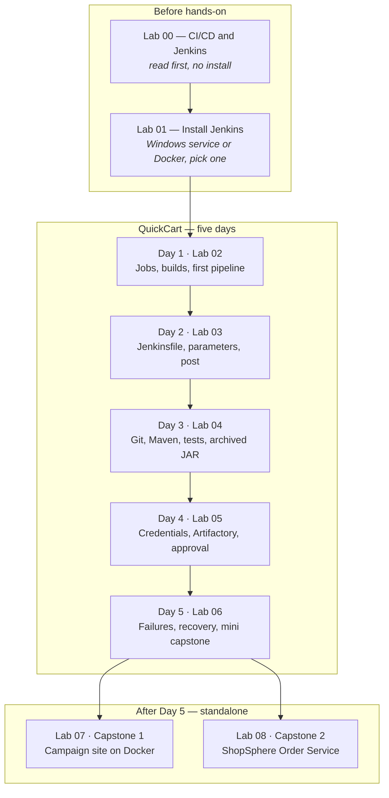

# Jenkins CI/CD

**Duration:** 5 Half Days × 4 Hours

Hands-on labs follow one company, **QuickCart**, from Jenkins basics through a pipeline that builds the Order Service, runs tests, publishes to Artifactory, and deploys after approval. **Lab 00** covers the concepts before install. **Lab 01** installs Jenkins on Windows or Docker. Days 1–5 map to **Labs 02–06**. Optional capstones **Lab 07** (Docker campaign site) and **Lab 08** (ShopSphere Order Service) stand alone after Day 5.

---

## Day 1 – Jenkins & CI/CD Fundamentals

**Duration:** 4 Hours  
**Lab manual:** [Lab 02 — Jenkins and CI/CD Fundamentals](Lab%2002%20-%20Jenkins%20and%20CI-CD%20Fundamentals.md) · [Slides](Presentations/Day-1-Jenkins-and-CICD-Fundamentals.pdf)

### Module 1: Jenkins & CI/CD Fundamentals

**Topics**

- Introduction to Jenkins and CI/CD
- Continuous Integration (CI)
- Continuous Delivery (CD)
- Continuous Deployment
- CI vs CD vs Continuous Deployment
- Jenkins architecture
- Controller–Agent model
- Jobs, builds, nodes, and executors
- Freestyle vs Pipeline
- Pipeline-as-Code
- Software delivery lifecycle

*Concept briefing:* [Lab 00 — Introduction to CI/CD and Jenkins](Lab%2000%20-%20Introduction%20to%20CI-CD%20and%20Jenkins.md)

### Module 2: Introduction to Jenkins Pipelines

**Topics**

- Jenkins Pipeline overview
- Declarative vs Scripted Pipeline
- Basic Pipeline structure
- `pipeline`, `agent`, `stages`, `steps`
- Pipeline execution and visualization

**Hands-on**

- Explore Jenkins dashboard and configuration
- Create and execute a basic Jenkins job
- Review build history and console output
- Create a basic Jenkins Pipeline

*Install first:* [Lab 01 — Installation and Setup of Jenkins](Lab%2001%20-%20Installation%20and%20Setup%20Jenkins.md) (Windows service or Docker — complete one)

---

## Day 2 – Jenkins Pipeline & Jenkinsfile Development

**Duration:** 4 Hours  
**Lab manual:** [Lab 03 — Jenkins Pipeline and Jenkinsfile Development](Lab%2003%20-%20Jenkins%20Pipeline%20and%20Jenkinsfile%20Development.md) · [Slides](Presentations/Day-2-Jenkins-Pipeline-and-Jenkinsfile-Development.pdf)

### Module 2: Jenkins Pipeline Fundamentals – Continued

**Topics**

- Declarative Pipeline structure
- Pipeline stages and steps
- Environment variables
- Pipeline parameters
- Build triggers
- `post` actions
- Basic failure handling

### Module 3: Jenkinsfile Development

**Topics**

- Creating and managing a Jenkinsfile
- Jenkinsfile structure and stages
- Common Pipeline commands
- Environment configuration
- Credentials handling basics
- Timeouts and retries
- Post-build actions

**Hands-on**

- Create a Declarative Pipeline
- Create and configure Jenkinsfile
- Add multiple stages and steps
- Configure environment variables
- Add pipeline parameters
- Configure timeout and retry
- Add post-build actions
- Execute and review pipeline results

---

## Day 3 – SCM Integration, Builds & Quality

**Duration:** 4 Hours  
**Lab manual:** [Lab 04 — SCM Integration, Builds, and Quality](Lab%2004%20-%20SCM%20Integration%20Builds%20and%20Quality.md) · [Slides](Presentations/Day-3-SCM-Integration-Builds-and-Quality.pdf)

### Module 4: Source Code Management Integration

**Topics**

- Git/GitHub integration
- SCM checkout
- Webhooks vs polling
- Automated build triggering
- Brief Multibranch Pipeline overview

### Module 5: Builds, Artifacts & Quality Basics

**Topics**

- Automating application builds
- Maven as the example build tool
- Managing build artifacts
- Archiving artifacts
- Build versioning
- Running unit tests in pipelines
- Publishing test results
- Quality gates concept
- Brief SonarQube demonstration

**Hands-on**

- Connect Jenkins with a Git repository
- Configure SCM checkout
- Configure automated build trigger
- Execute Maven build
- Run unit tests
- Publish test results
- Archive build artifacts
- Review basic quality-gate concepts

---

## Day 4 – Credentials, Artifactory & Deployment

**Duration:** 4 Hours  
**Lab manual:** [Lab 05 — Credentials, Artifactory, and Deployment](Lab%2005%20-%20Credentials%20Artifactory%20and%20Deployment.md) · [Slides](Presentations/Day-4-Credentials-Artifactory-and-Deployment.pdf)

### Module 6: Credentials & Security Essentials

**Topics**

- Jenkins Credentials Store
- Username/password credentials
- SSH keys
- Secret text
- Secure credential usage in pipelines
- Avoiding secrets in logs

### Module 7: Artifact Management with JFrog Artifactory

**Topics**

- Purpose of artifact repositories
- JFrog Platform overview
- Local, remote, and virtual repositories
- Configuring Jenkins with Artifactory
- Publishing artifacts
- Downloading artifacts
- Artifact promotion
- Build Once, Deploy Many concept

### Module 8: Deployment & Operations Awareness

**Topics**

- Dev → QA → UAT → Production
- Approval gates
- Manual intervention
- Rollback strategies – conceptual overview

**Hands-on**

- Configure and use Jenkins credentials
- Integrate Jenkins with Artifactory
- Publish and retrieve an artifact
- Add a manual approval step

---

## Day 5 – Operations, Troubleshooting & Mini Capstone

**Duration:** 4 Hours  
**Lab manual:** [Lab 06 — Operations, Troubleshooting, and Mini Capstone](Lab%2006%20-%20Operations%20Troubleshooting%20and%20Mini%20Capstone.md) · [Slides](Presentations/Day-5-Operations-Troubleshooting-and-Mini-Capstone.pdf)

### Module 8: Deployment & Operations Awareness – Continued

**Topics**

- Reading pipeline logs
- Handling failed stages
- Basic troubleshooting
- Credential issues
- SCM issues
- Agent issues
- Deployment failure awareness

### Module 9: Mini Capstone

**Hands-on capstone**

- Configure Git repository
- Create Jenkinsfile
- Configure automated build
- Run unit tests
- Publish artifact to Artifactory
- Add manual approval gate
- Execute simulated deployment
- Deliberately break the build
- Review pipeline logs
- Identify and troubleshoot the failure
- Fix and rerun the pipeline

**Capstone deliverables**

- Working Jenkinsfile
- Successful Jenkins pipeline
- Automated build and test execution
- Artifact published to Artifactory
- Manual approval and simulated deployment
- Pipeline run evidence

---

## Optional capstones (after Day 5)

| Capstone | Duration | Manual |
|---|---|---|
| Capstone 1 — Campaign site on Docker | 2–3 hours | [Lab 07](Lab%2007%20-%20Capstone%201%20Deploy%20Web%20App%20on%20Docker.md) |
| Capstone 2 — ShopSphere Order Service | 3–4 hours | [Lab 08](Lab%2008%20-%20Capstone%202%20ShopSphere%20Order%20Service.md) |

Capstone 1 does not use Maven or Artifactory. Capstone 2 is a new company, new repository, and full CI/CD assessment.

---

## Learning path

The main track is five days on **QuickCart** (Labs 02–06). Capstones are separate manuals you can take in either order after Day 5.

| Step | Manual | Focus |
|---|---|---|
| Read first | Lab 00 | Concepts and the QuickCart story |
| Setup once | Lab 01 | Controller running, smoke-test job |
| Days 1–5 | Labs 02 → 06 | One Order Service pipeline end to end |
| Optional | Lab 07 or Lab 08 | Docker delivery, or a full CI/CD assessment on a new repo |

Complete Lab 1 or Lab 2 inside Lab 01. Days 1–5 then use the same Jenkins screens. Where a command differs, each lab gives a Docker version and a Windows service version.

## Lab manuals index

| When | Manual | What the learner does |
|---|---|---|
| Before Day 1 | [Lab 00 — Introduction to CI/CD and Jenkins](Lab%2000%20-%20Introduction%20to%20CI-CD%20and%20Jenkins.md) | Read the QuickCart story. No install |
| Setup | [Lab 01 — Installation and Setup of Jenkins](Lab%2001%20-%20Installation%20and%20Setup%20Jenkins.md) | Windows service or Docker. Complete one |
| Day 1 | [Lab 02 — Jenkins and CI/CD Fundamentals](Lab%2002%20-%20Jenkins%20and%20CI-CD%20Fundamentals.md) | Five hands-on labs |
| Day 2 | [Lab 03 — Jenkins Pipeline and Jenkinsfile Development](Lab%2003%20-%20Jenkins%20Pipeline%20and%20Jenkinsfile%20Development.md) | Five hands-on labs |
| Day 3 | [Lab 04 — SCM Integration, Builds, and Quality](Lab%2004%20-%20SCM%20Integration%20Builds%20and%20Quality.md) | Five hands-on labs |
| Day 4 | [Lab 05 — Credentials, Artifactory, and Deployment](Lab%2005%20-%20Credentials%20Artifactory%20and%20Deployment.md) | Five hands-on labs |
| Day 5 | [Lab 06 — Operations, Troubleshooting, and Mini Capstone](Lab%2006%20-%20Operations%20Troubleshooting%20and%20Mini%20Capstone.md) | Four hands-on labs |
| Capstone 1 | [Lab 07 — Deploy a Web App on Docker](Lab%2007%20-%20Capstone%201%20Deploy%20Web%20App%20on%20Docker.md) | Standalone |
| Capstone 2 | [Lab 08 — ShopSphere Order Service](Lab%2008%20-%20Capstone%202%20ShopSphere%20Order%20Service.md) | Standalone. New repository |

Every Java file, `pom.xml`, `Jenkinsfile`, Dockerfile, and HTML page is written in the lab that asks the learner to create it. This repository does not contain a starter application.

## Class environment

| Needed from | Used by |
|---|---|
| Browser, and either the Jenkins LTS Windows installer plus JDK 21, or Docker and `jenkins/jenkins:lts` | Lab 01, then every later lab |
| Git, and one empty remote per learner | Day 2 onward. Capstone 2 needs a second, empty remote |
| Maven 3.9 on the learner’s computer. Jenkins downloads the same Maven into the agent as the tool `Maven-3.9` | Day 3, Day 4, Day 5, Capstone 2 |
| JFrog Artifactory: URL, repository, username, and password or token | Day 4, Day 5, Capstone 2 |
| Docker on the machine that runs the container | Lab 01 Docker path, and Capstone 1 |
